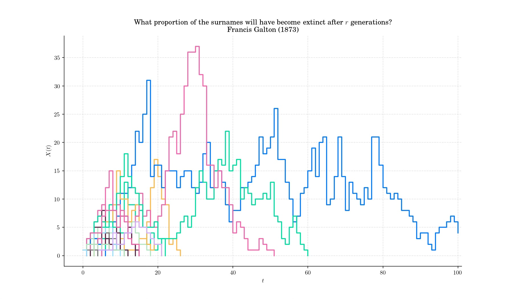
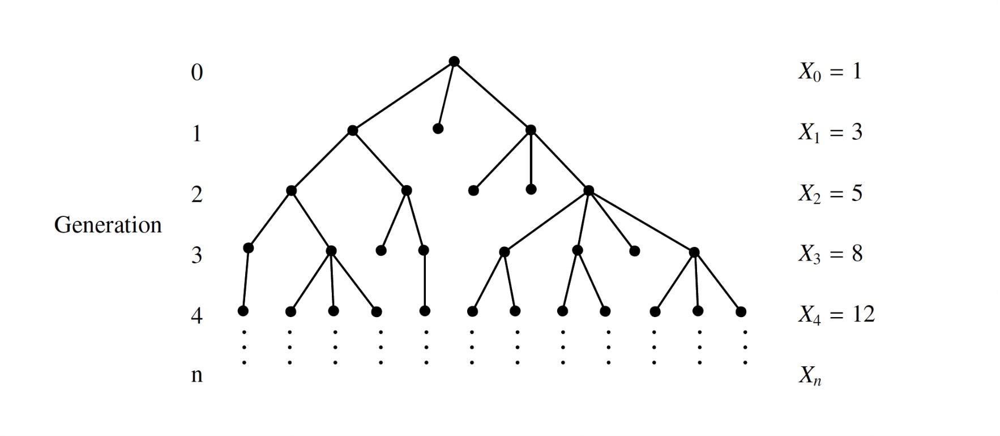
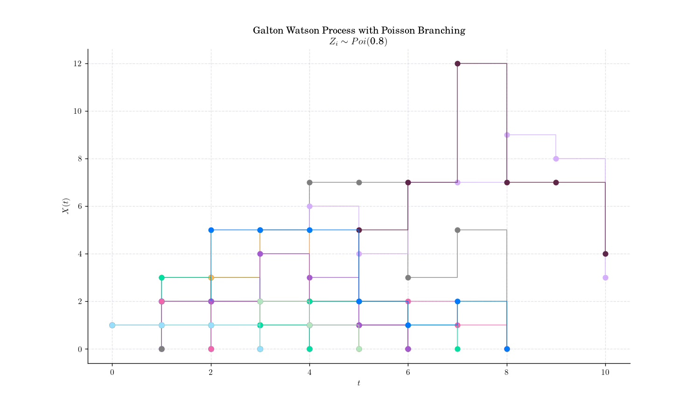
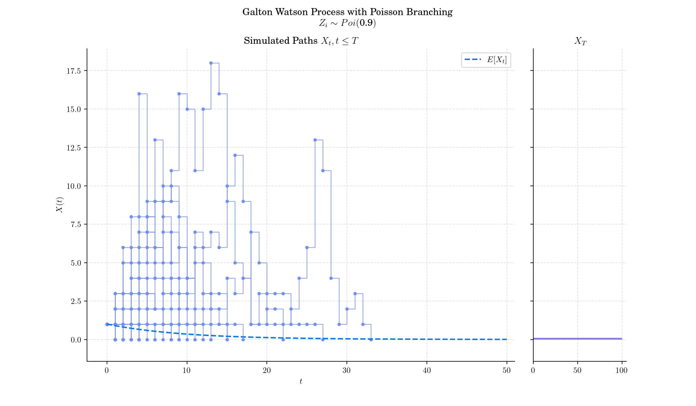
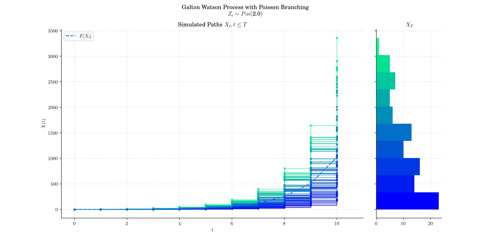

### Day 3: Galton-Watson Branching Process

The Galton-Watson branching process (or simply Galton-Watson process) is the simplest possible model for a population evolving in time. It is based on the assumption that individuals in the population give birth to a number of children independently of each other and all with the same distribution.

- 

- 

#### Definition

A Galton–Watson process is a stochastic process $\{X_n\}$ which evolves according to the recurrence formula $X_0 = 1$ and

$$X\_{n+1} = \sum\_{j=1}^{X\_n} Z\_j^{(n)},$$

where $\{Z\_j^{(n)}. : n, j \in \mathbb{N}\}$ is a set of [independent and identically-distributed](https://en.wikipedia.org/wiki/Independent_and_identically-distributed_random_variables) natural number-valued random variables.

- 

- 

#### 🔔 Random Facts 🔔

- In the nineteenth century, there was concern amongst the Victorians that aristocratic surnames were becoming extinct. In 1873, British polymath [Francis Galton](https://en.wikipedia.org/wiki/Francis_Galton) originally posed the question regarding the probability of such an event in an issue of “The Educational Times”

British mathematician [H. W. Watson](https://en.wikipedia.org/wiki/Henry_William_Watson) later replied with a solution. Together, they then wrote a paper in 1874 entitled "On the probability of the extinction of families" in the _Journal of the Anthropological Institute of Great Britain and Ireland_ (now the _[Journal of the Royal Anthropological Institute](https://en.wikipedia.org/wiki/Journal_of_the_Royal_Anthropological_Institute)_).

- In the late 1930s, [Leo Szilard](https://en.wikipedia.org/wiki/Leo_Szilard) independently reinvented Galton-Watson processes to describe the behavior of free neutrons during [nuclear fission](https://en.wikipedia.org/wiki/Nuclear_fission). This work involved generalizing formulas for extinction probabilities, which became essential for calculating the critical mass required for a continuous chain reaction with fissionable materials.

- Suppose that $\mu = E(Z\_i) ∈(0,+∞)$. Then:
    - Subcritical case (µ<1), on average, each individual produces fewer than one offspring. Over time, the population tends to shrink. In this case, extinction is almost certain, even if some individuals initially have many offspring. The decline happens because the average reproduction rate is insufficient to sustain or grow the population.

    - Critical case (µ= 1), each individual produces, on average, exactly one offspring. The population neither grows nor shrinks on average but fluctuates due to randomness. In this case, extinction is inevitable over time, although it happens more slowly than in the subcritical case. Random fluctuations will eventually reduce the population to zero.

    - Supercritical case (µ>1), Each individual produces more than one offspring on average, leading to potential exponential growth in the population. In this case, while there's still a chance of extinction, it's not guaranteed. If the population avoids early extinction, it will likely grow exponentially

- The Galton-Watson process marked the birth of [branching processe](https://en.wikipedia.org/wiki/Branching_process)s, a key concept in probability theory. Branching processes are now foundational tools for modeling phenomena like the spread of diseases or the replication of computer algorithms.

- Applications of the Galton-Watson process in [Evolutionary Genetics](https://www.sciencedirect.com/topics/biochemistry-genetics-and-molecular-biology/evolutionary-genetics) date at least back to the 1920's in a work by Haldane on the survival of mutant genes.

- More recently, the Galton-Watson processes has been used to study the concept of a [mitochondrial Eve](https://en.wikipedia.org/wiki/Mitochondrial_Eve)—the most recent common female ancestor of all humans through maternal lines.

#### More to Read

- [Kendall, D.G. (1966), Branching Processes Since 1873. Journal of the London Mathematical Society, s1-41: 385-406.](https://londmathsoc.onlinelibrary.wiley.com/doi/abs/10.1112/jlms/s1-41.1.385) [https://doi.org/10.1112/jlms/s1-41.1.385](https://doi.org/10.1112/jlms/s1-41.1.385)

- Armando G.M. Neves, Carlos H.C. Moreira, Applications of the Galton–Watson process to human DNA evolution and demography, Physica A: Statistical Mechanics and its Applications, Volume 368, Issue 1, 2006, Pages 132-146, ISSN 0378-4371, https://doi.org/10.1016/j.physa.2005.11.055 (https://www.sciencedirect.com/science/article/pii/S0378437106001099)

- Haldane JBS. A Mathematical Theory of Natural and Artificial Selection, Part V: Selection and Mutation. _Mathematical Proceedings of the Cambridge Philosophical Society_. 1927;23(7):838-844. doi:10.1017/S0305004100015644

- [Families, Farms, and Fission](https://www.lancaster.ac.uk/stor-i-student-sites/matthew-speers/2022/02/01/families-farms-and-fission/)

P.s. If you are curious about probability distributions visit the [Advent Calendar 2023](https://quantgirl.blog/advent-calendar-2023/) ✨
