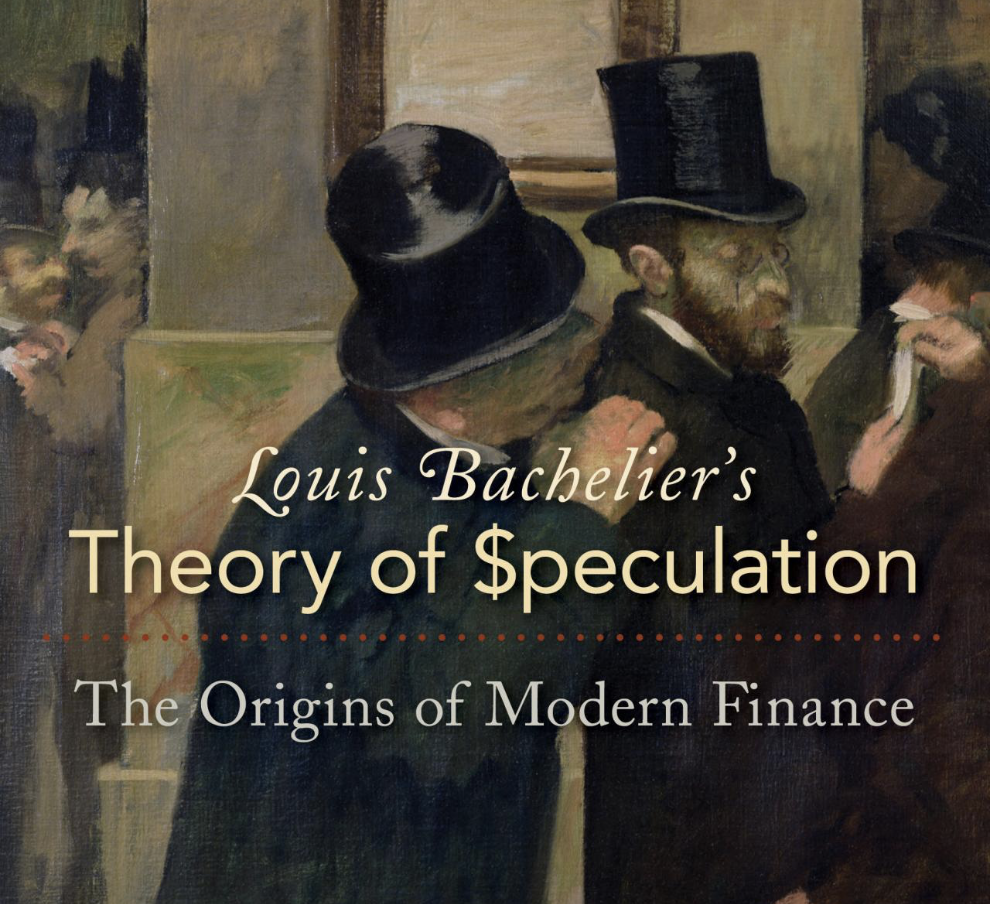

### Day 5: Arithmetic Brownian Motion

The Arithmetic Brownian motion, or Brownian motion with drift and scale, is a stochastic process describing the dynamics of a value that changes over time with two key components: a steady, deterministic trend plus a random part driven by a [Brownian motion](https://quantgirl.blog/advent-calendar-2024-day-4-brownian-motion/).

#### Definition

The Arithmetic Brownian motion can be defined by the following Stochastic Differential Equation (SDE)

$$dX\_t = \mu dt + \sigma dW\_t, \quad t >0,$$

with initial condition $X\_0 =x\_0$, and constant parameters $\mu\in \mathbb{R}$, $\sigma>0$. Without loss of generality we are going to assume that $x\_0=0$. Here, $W\_t$ denotes a standard Brownian motion.

This equation is equivalent to

$$X\_t = \int\_0^t \mu ds + \int\_0^t \sigma dW\_t = \mu t + \sigma W\_t,$$

which gives us the solution.

A drifted d−dimensional Brownian motion is a vector-valued stochastic process defined as

$$X(t) = (X\_1(t) ,X\_2(t), \cdots, X\_d(t)), \qquad \geq 0,$$  
whose components $X\_i$ are independent, one-dimensional Arithmetic Brownian motions.

#### 🔔 Random Facts 🔔

- The Arithmetic Brownian model was postulated by [Louis Bachelier](https://en.wikipedia.org/wiki/Louis_Bachelier) on his PhD thesis "Theory of Speculation" (1900) as a mathematical model for stock prices movements --known today as the [Bachelier model](https://en.wikipedia.org/wiki/Bachelier_model).

- One early criticism of the Bachelier model is that the probability distribution which he chose to use to describe **stock prices allowed for negative prices**. His doctoral dissertation was graded down because of that feature. Today, such feature has became an advantage of the model!

- On April 8, 2020, the [CME Group](https://en.wikipedia.org/wiki/CME_Group) posted the note _CME Clearing Plan to Address the Potential of a Negative Underlying in Certain Energy Options Contracts_,[\[1\]](https://en.wikipedia.org/wiki/Bachelier_model#cite_note-1) saying that after a threshold on price, it would change its standard energy options model from one based on Geometric Brownian Motion and the Black–Scholes model to the Bachelier model.

#### More to Read

- [L. Bachelier, “Theory of Speculation: The Origins of Modern Finance,” Princeton University Press, Princeton, 1900.](https://www.investmenttheory.org/uploads/3/4/8/2/34825752/emhbachelier.pdf)

- [Brownian Motion Notebook](https://quantgirluk.github.io/Understanding-Quantitative-Finance/brownian_motion_arithmetic.html) (part of my series of notes exploring concepts with Python)

P.s. If you are curious about probability distributions visit the [Advent Calendar 2023](https://quantgirl.blog/advent-calendar-2023/) ✨
