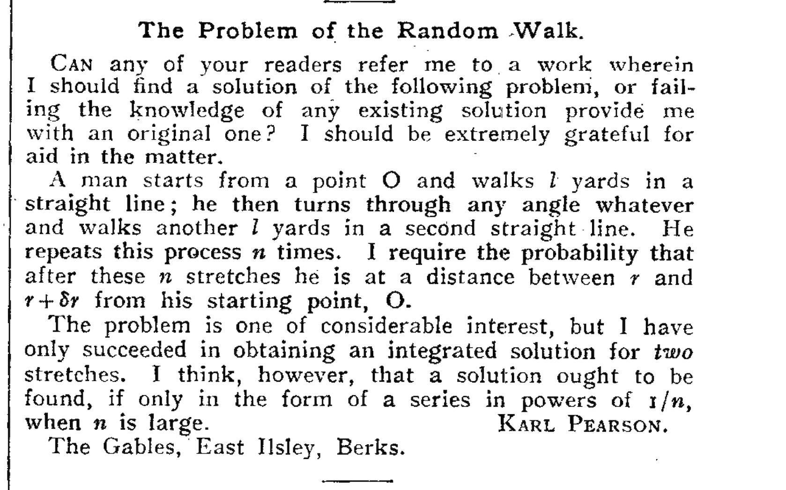

### Day 8 : General Random Walk

Today we re-visit the Random Walk from Day 1, with the aim of illustrating this stochastic process in cases beyond the Simple Random Walk.

#### Definition

Let $\{Z\_i, i \geq 1\}$ be a sequence of real-valued independent an identically distributed (i.i.d.) random variables defined on a probability space $(\Omega, \mathcal{F}, \mathbb{P})$. Then, the stochastic process $\{X\_n , n\geq 0\}$, defined as $X\_0 =0$, and

$$X\_n = \sum\_{i=1}^n Z\_i, \qquad \forall n\geq 1,$$

is called [random walk](https://en.wikipedia.org/wiki/Random_walk), or more precisely one-dimensional random walked based on $\{Z\_i, i \geq 1\}$.

On Day 1 we illustrated the elementary example of a random walk which starts at 0 and at each step moves +1 or −1 with equal probability, i.e. p=0.5.

Obviously the first way to generalise this example is by considering different probabilities. For example, considering p=0.25, 0.75, we obtain.

One can generalise this further by considering different distributions for the steps $\{Z\_i, i \geq 1\}$.

#### 🔔 Random Facts 🔔

- The term random walk was introduced by English biostatistician and mathematician [Karl Pearson](https://en.wikipedia.org/wiki/Karl_Pearson) in a letter to the journal [_Nature_ in 1905](http://www.e-m-h.org/Pear05.pdf). In this letter, Pearson described a problem that involved a person taking a series of steps in random directions and inquired about the resulting distance from the starting point after a large number of steps:

- A Random Walk in one or two dimensions is recurrent, meaning that a walker starting at a point will, with probability 1, eventually return to that point. However, in three or more dimensions, the Random Walk becomes transient, where there is a non-zero probability that the walker will never return to the starting point. This fascinating result is known as _[Pólya's Recurrence Theorem](https://tylerzhu.com/assets/handouts/polya_rec.pdf)_.

- The trajectory of a Random Walk in two or three dimensions forms a fractal-like structure. For example, in two dimensions, the fractal dimension of the Random Walk's path is 2, meaning it densely fills the plane.

- In epidemiology, Random Walks can model the spread of infectious diseases by simulating how individuals move and interact in a population. This helps in predicting infection patterns and formulating strategies to mitigate outbreaks.

- Brownian motion can be seen as the limit of a Random Walk when the step size and time intervals between steps become infinitely small. This connection is formalised in the result known as [_Donsker's invariance principle_](https://quantgirl.blog/donsker-random-walk/) or the Functional Central Limit Theorem.

P.s. If you are curious about probability distributions visit the [Advent Calendar 2023](https://quantgirl.blog/advent-calendar-2023/) ✨
