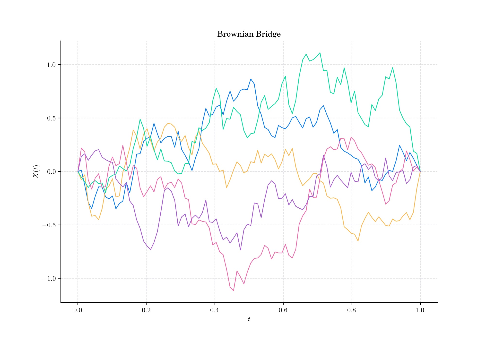
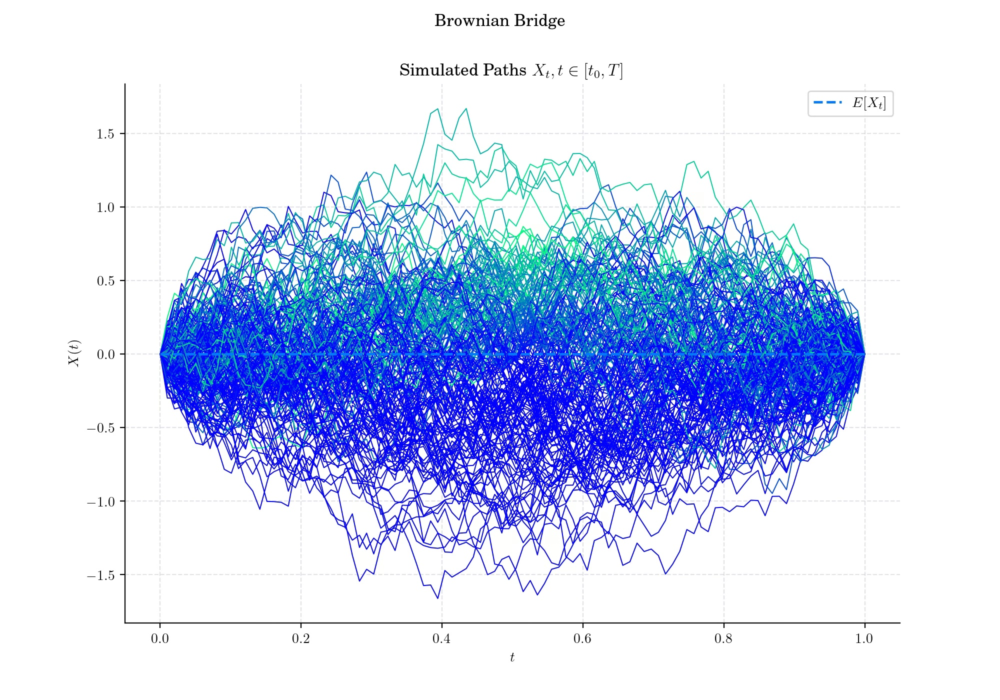
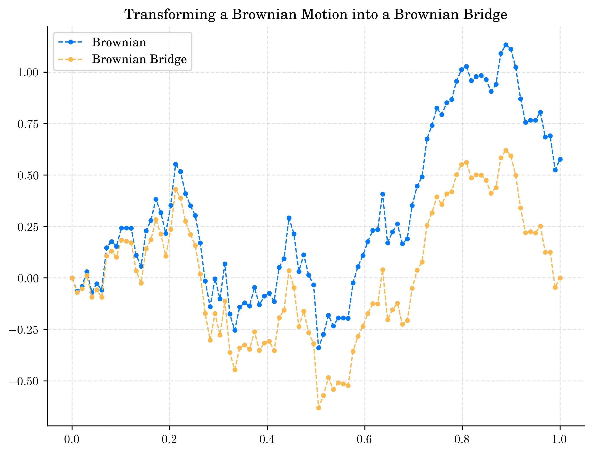
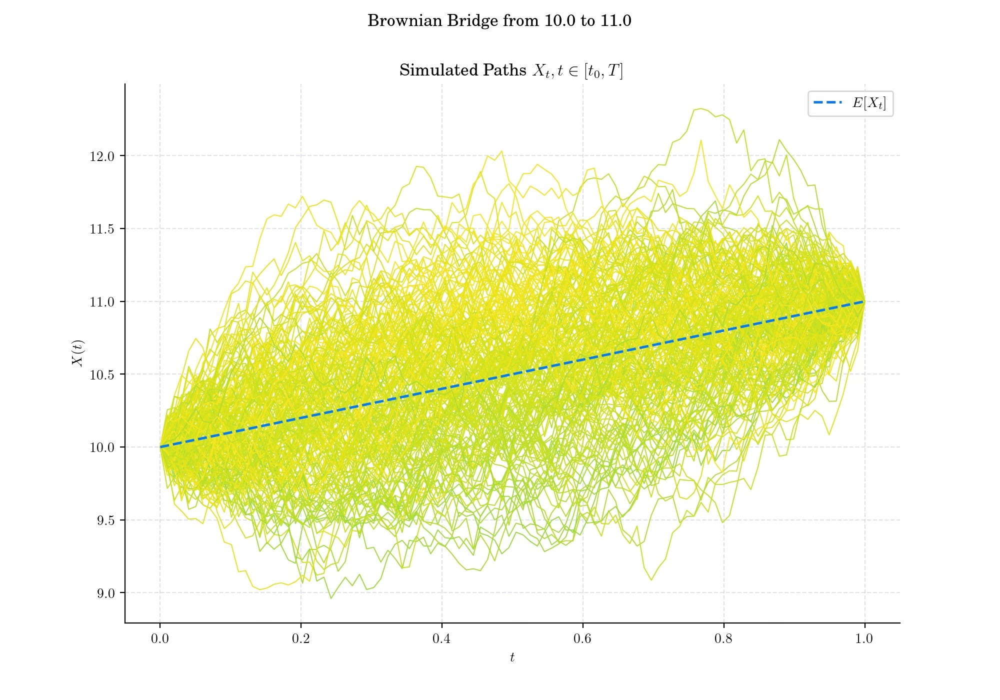
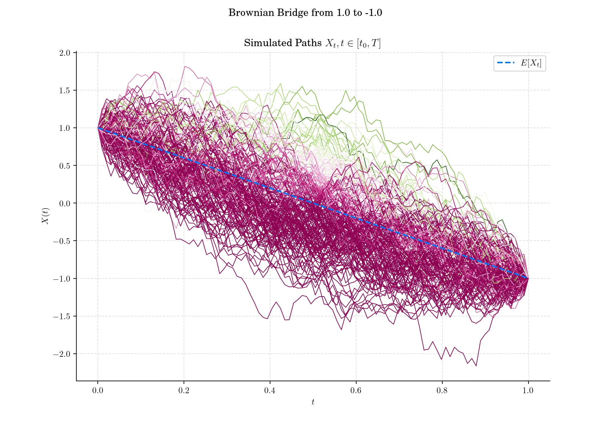

### Day 9 : Brownian Bridge

A [Brownian bridge](https://en.wikipedia.org/wiki/Brownian_bridge), also called tied-down Brownian motion,  is a continuous-time Gaussian process whose probability distribution is the conditional probability distribution of a standard [Wiener process](https://en.wikipedia.org/wiki/Wiener_process) $W(t)$ on $\[0,T\]$ subject to the condition that $W(T)=0$, so that the process is pinned to the same value at both $t=0$ and $t=T$. 

#### Definition

The normalised Brownian Bridge is a classical Brownian motion defined on the interval $\[0,T\]$  and conditioned on the event $W(T)=0$. Thus, the Brownian bridge is the process defined as:

$$X(t) = \{ W(t), 0\leq t\leq T \mid W(T) =0 \}.$$

Given a Winer process $W$ defined on $\[0,T\]$ the process defined as

$$X(t) = W(t) - \frac{t}{T} W(T), \qquad 0\leq t \leq T,$$

is a Brownian Bridge on $\[0,T\]$. Conversely, if $X$ is a Brownian Bridge defined on $\[0,1\]$and $Z$ is a standard [normal](https://en.wikipedia.org/wiki/Normal_distribution) random variable independent of $X$, then the process

$$W(t) = X(t) + t Z, \qquad 0\leq t \leq 1,$$

is a Wiener process defined on $\[0,1\]$.

The Brownian bridge is useful for modelling a system that starts at some given level and is expected to return to that level at some specified future time. Moreover, this can be generalised to the case when the end-point is fixed but not necessarily equal to the initial point.

#### 🔔 Random Facts 🔔

- The Brownian Bridge emerged as a natural extension of the Wiener process, focusing on the behaviour of a this process when conditioned to hit specific boundary conditions. The term “Brownian Bridge” itself reflects its structure, metaphorically “bridging” the stochastic process between fixed points.

- A Brownian bridge is the result of [Donsker's theorem](https://en.wikipedia.org/wiki/Donsker%27s_theorem) in the area of [empirical processes](https://en.wikipedia.org/wiki/Empirical_process).

- It underpins the [Kolmogorov-Smirnov test](https://en.wikipedia.org/wiki/Kolmogorov–Smirnov_test), a non-parametric method to compare empirical and theoretical distributions. The test statistic is defined as $$K = \sup\_{t \in \[0,1\]} |X(t)|$$

- It is extensively used in Financial applications to enhance Monte Carlo simulations

### More to Read 📚

- Jim Pitman. "Brownian Motion, Bridge, Excursion, and Meander Characterized by Sampling at Independent Uniform Times." Electron. J. Probab. 4 1 - 33, 1999. [https://doi.org/10.1214/EJP.v4-48](https://doi.org/10.1214/EJP.v4-48)

- Li, Xue-Mei. “Generalised Brownian bridges: examples.” _arXiv: Probability_ (2016): n. pag. [https://arxiv.org/abs/1612.08716](https://arxiv.org/abs/1612.08716)

- Junyi Lin, Xiaoqun Wang, New Brownian bridge construction in quasi-Monte Carlo methods for computational finance, Journal of Complexity, Volume 24, Issue 2, 2008, Pages 109-133, ISSN 0885-064X, https://doi.org/10.1016/j.jco.2007.06.001

P.s. If you are curious about probability distributions visit the [Advent Calendar 2023](https://quantgirl.blog/advent-calendar-2023/) ✨
