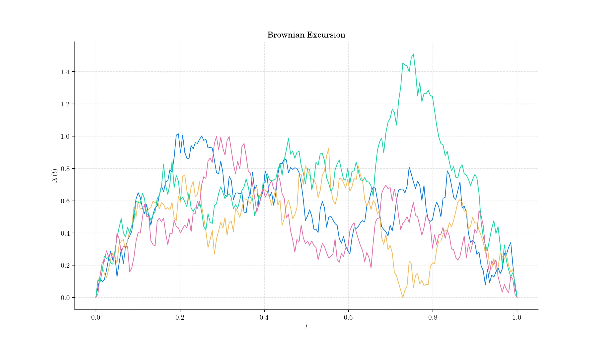
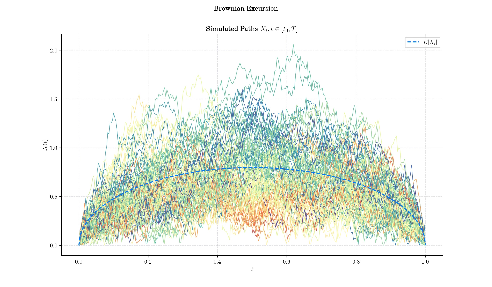
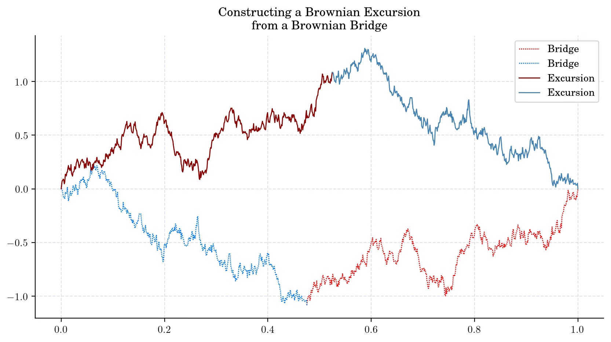
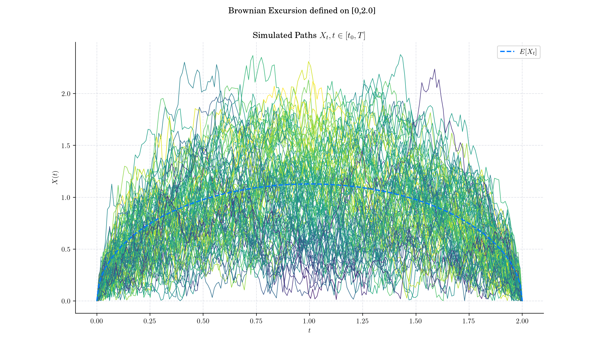
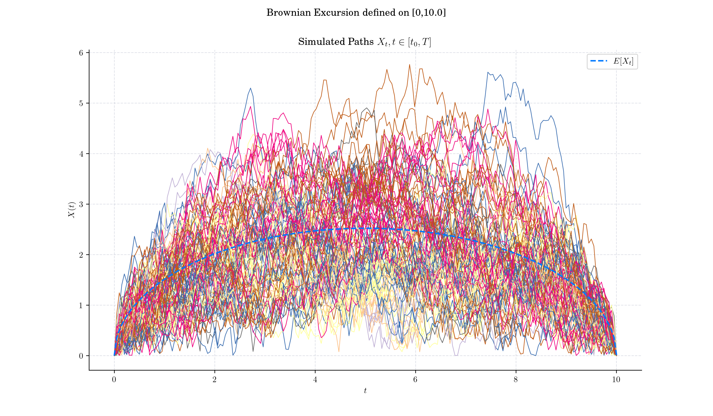
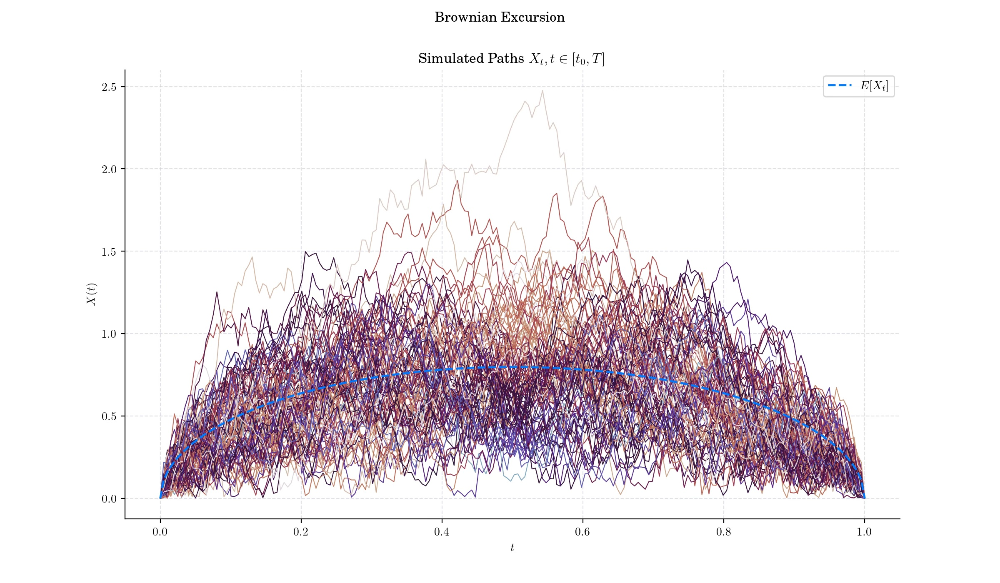

### Day 10 : Brownian Excursion

A Brownian excursion is yet another stochastic process which arises from a Weiner process (standard Brownian motion) with the additional condition that it stays positive over a given interval and ends at zero. It is particularly significant in probability theory, combinatorics, and applications like queuing theory and random geometry.

#### Definition

A normalised Brownian excursion is a nonnegative real-valued stochastic proces**s** $X$ defined on the interval $\[0,1\]$ which can be constructed from a standard Brownian motion $W$ on $\[0,T\]$ by conditioning on it being nonnegative on $(0,T)$ and equal to zero at the end time. Alternatively, it is a [Brownian bridge](https://en.wikipedia.org/wiki/Brownian_bridge) process conditioned to be positive.

We can obtain a Brownian Excursion from a Brownian Bridge path by using the so called Vervaat construction. Let $\tau\_m$ be the time at which a Brownian Bridge process $W\_b$ achieves its minimum on $\[0, 1\]$. Vervaat (1979) shows that the process defined as:

$$\{W\_b(\tau\_m + t \mod 1) - W\_b(\tau\_m), \quad 0\leq t\leq 1 \},$$

is a Brownian excursion.

#### 🔔 Random Facts 🔔

- Brownian Excursions are deeply connected to combinatorial structures, particularly random trees and [Catalan numbers](https://en.wikipedia.org/wiki/Catalan_number). See [https://cs.uwaterloo.ca/journals/JIS/VOL14/Whitt/whitt6.pdf](https://cs.uwaterloo.ca/journals/JIS/VOL14/Whitt/whitt6.pdf)

- In polymer physics, the shape of a polymer chain confined to a half-plane (or subject to some spatial constraint) can be modeled by a Brownian Excursion.

- If $X(t)$ is a Brownian excursion then so is $\tilde{X}(t) = X(1-t)$.

### More to Read 📚

- Jim Pitman. "Brownian Motion, Bridge, Excursion, and Meander Characterized by Sampling at Independent Uniform Times." Electron. J. Probab. 4 1 - 33, 1999. [https://doi.org/10.1214/EJP.v4-48](https://doi.org/10.1214/EJP.v4-48)

- Knight, Frank B. “On the Excursion Process of Brownian Motion.” _Transactions of the American Mathematical Society_, vol. 258, no. 1, 1980, pp. 77–86. _JSTOR_, https://doi.org/10.2307/1998281. Accessed 10 Dec. 2024.

- Kai Lai Chung. "Maxima in Brownian excursions." Bull. Amer. Math. Soc. 81 (4) 742 - 745, July 1975.

P.s. If you are curious about probability distributions visit the [Advent Calendar 2023](https://quantgirl.blog/advent-calendar-2023/) ✨
