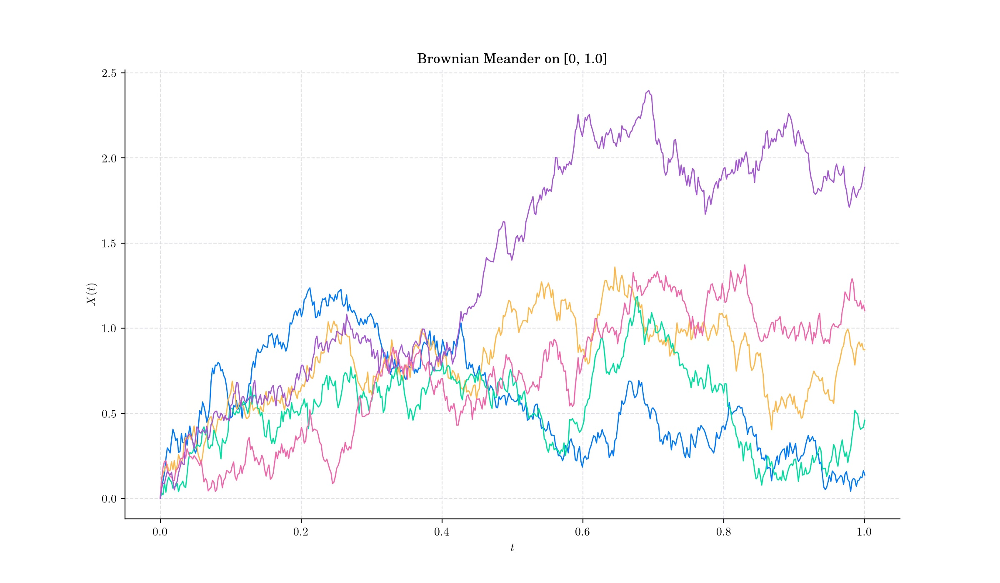
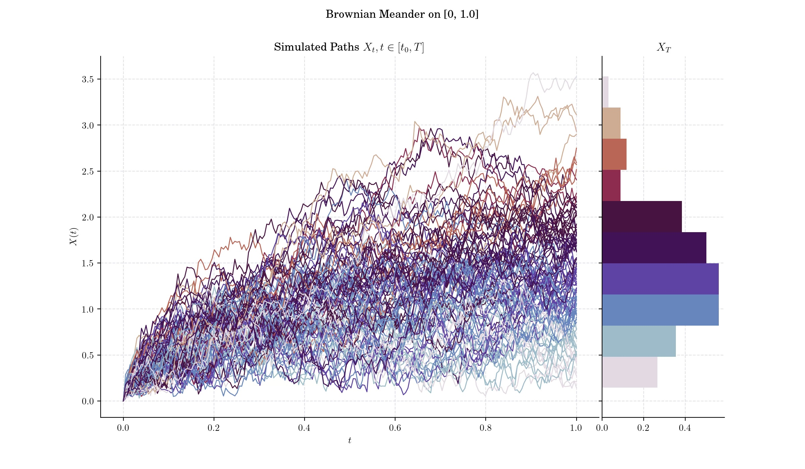
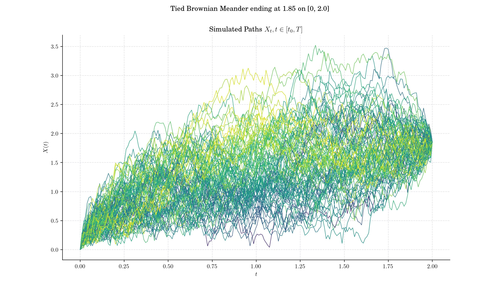
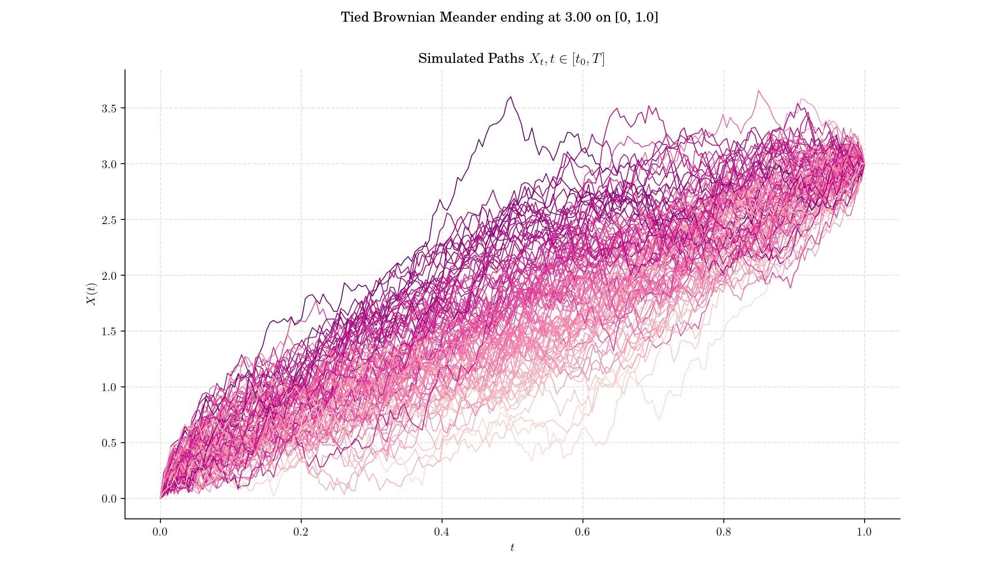
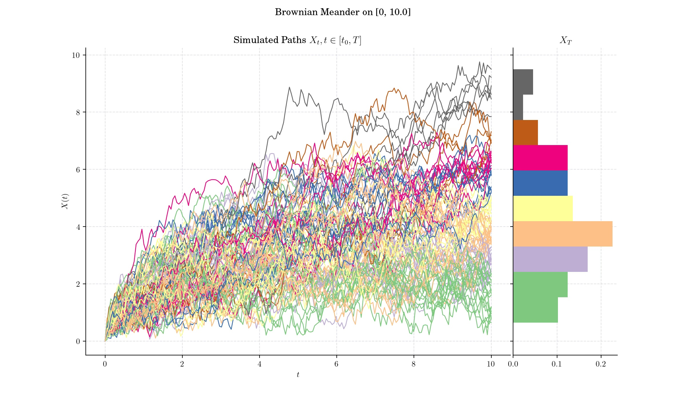

### Day 11 : Brownian Meander

A Brownian Meander is yet another stochastic process which arises from a Weiner process (standard Brownian motion) with the additional condition that it stays positive over a given interval.

#### Definition

Let $W=\{W(t), t\geq 0\}$ be a standard one-dimensional [Brownian motion](https://en.wikipedia.org/wiki/Wiener_process), and 

$$\tau = \sup\{ t\in \[0,1\] : W(t) = 0 \},$$

i.e. the last time before $t=1$ when W visits zero. Then the Brownian meander is defined by the following expression

$$X(t) = \frac{1}{1 - \tau} | W(\tau + t(1-\tau)) |, \qquad t \in \[0,1\].$$

That is, given the last time before 1 that a standard Brownian motion visits zero (note that $\tau <1$ almost surely), we snip off and discard the trajectory before $\tau$, and scale the remaining part so that it spans a time interval of length 1. The scaling factor for the spatial axis must be square root of the scaling factor for the time axis. The process resulting from this snip-and-scale procedure is a Brownian meander. 

#### 🔔 Random Facts 🔔

- Both the Brownian Meander and the Brownian Excursion arise as the limit process in the study of the behaviour of random walks conditioned to stay positive.

- Brownian meanders emerge in path decompositions of the Brownian motion. In particular Denisov (1984) showed that a Brownian motion around a maximum point can be represented (in law) by means of a two-sided Brownian meander, which is constructed by gluing together two meanders.

- If $X$ is a Brownian meander then $X(t)$ has probability density  $$ 2 t^{-\frac{3}{2}} x e^{-\frac{x^2}{2t}} \Phi\_{1-t}(x), \qquad x>0, t \in \[0,1\].$$

- In a similar fashion as the Brownian Bridge, the Brownian Meander can be restricted to end on a particular point. Such process is the so-called a Tied Brownian Meander. The Tied Brownian Meander has more complicated distributional properties compared to the unconstrained Brownian motion or the regular meander.

### More to Read 📚

- Jim Pitman. "Brownian Motion, Bridge, Excursion, and Meander Characterized by Sampling at Independent Uniform Times." Electron. J. Probab. 4 1 - 33, 1999. [https://doi.org/10.1214/EJP.v4-48](https://doi.org/10.1214/EJP.v4-48)

- I. V. Denisov. A random walk and a wiener process near a maximum. Theor. Prob. Appl., 28:821–824, 1984.

- Richard T. Durrett. Donald L. Iglehart. Douglas R. Miller. "Weak Convergence to Brownian Meander and Brownian Excursion." Ann. Probab. 5 (1) 117 - 129, February, 1977.https://doi.org/10.1214/aop/1176995895

P.s. If you are curious about probability distributions visit the [Advent Calendar 2023](https://quantgirl.blog/advent-calendar-2023/) ✨
