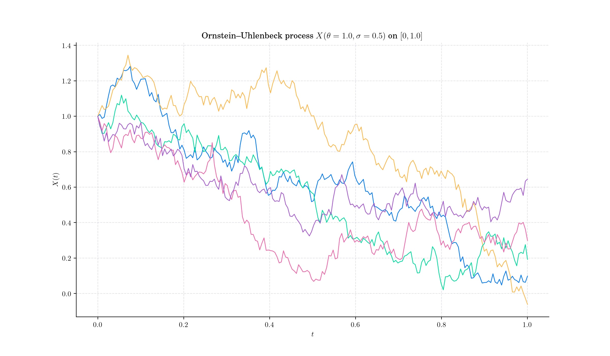
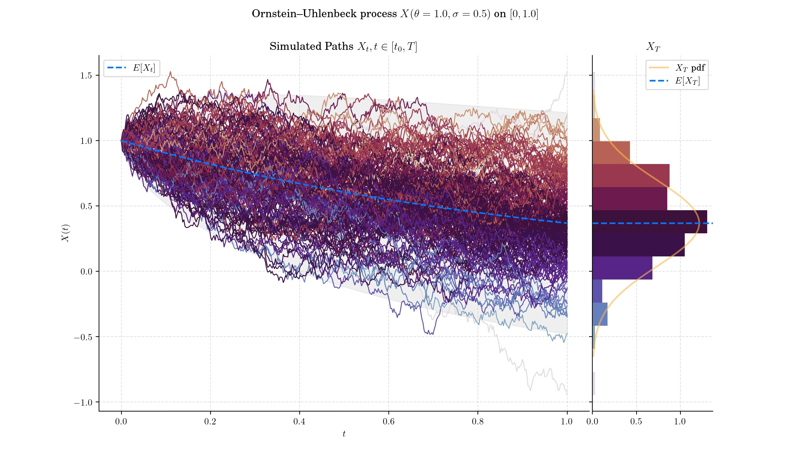
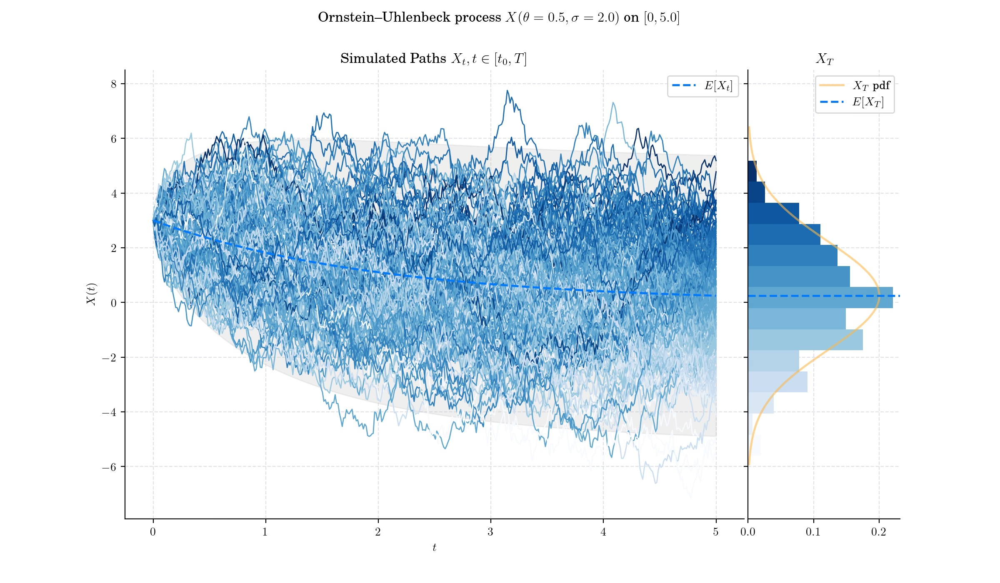
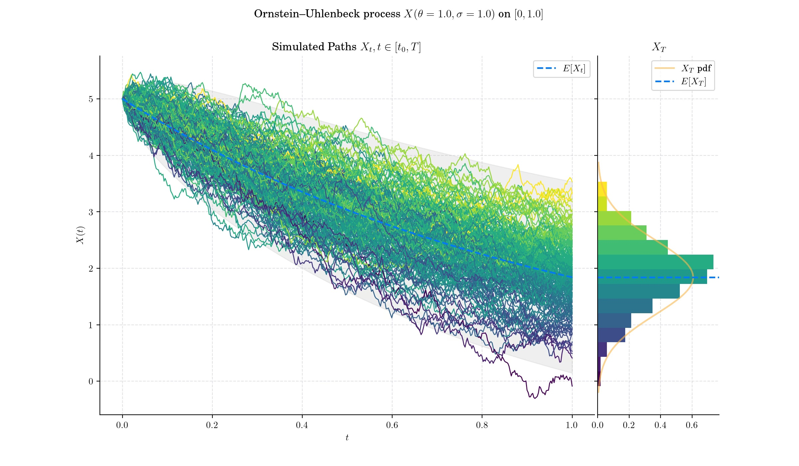
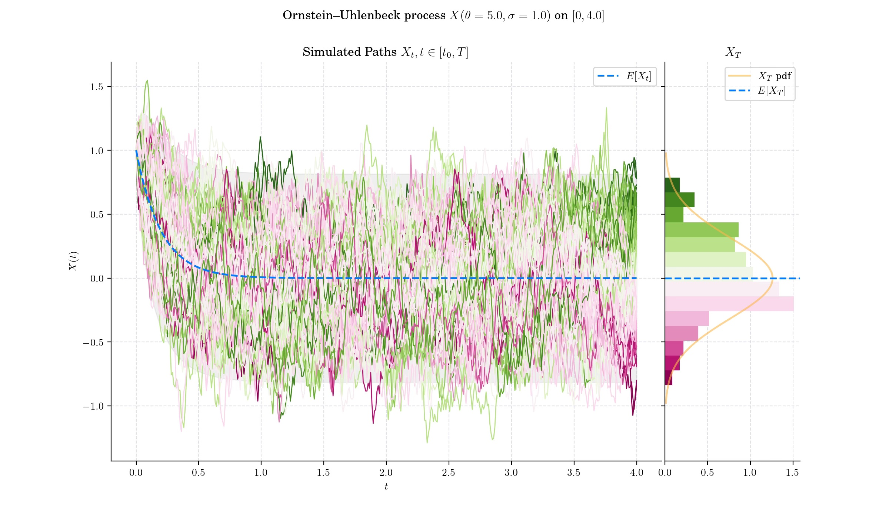

### Day 12 : Ornstein-Uhlenbeck

The Ornstein-Uhlenbeck (OU) process is a stochastic process that plays a critical role in fields like physics, finance, and biology. It is a type of Gaussian process known for its mean-reverting properties, making it particularly useful for modelling phenomena that oscillate around a long-term average.

#### Definition

The Ornstein–Uhlenbeck process $X=\{X(t) : t\geq 0\}$ is defined by the following stochastic differential equation:

$$dX\_t = -\theta X\_t dt + \sigma dW\_t, \qquad t\geq 0,$$

with initial condition $X(0) = x\_0$; where $\theta>0$ and $\sigma >0$ are constant parameters and $W$ denotes the Wiener process. In order to find the solution to this SDE, let us set the function $f(t,x) = x e^{\theta t}$. Then, Ito's formula implies

$$ X\_te^{\theta t} = x\_0 +\int\_0^t X\_s \theta e^{\theta s}ds + \int\_0^t e^{\theta s}dX\_s $$

$$= x\_0 + \int\_0^t \left\[ \theta X\_s e^{\theta s} - \theta e^{\theta s} X\_s\right\] ds + \int\_0^t e^{\theta s}\sigma dW\_s$$

$$= x\_0 + \int\_0^t e^{\theta s}\sigma dW\_s$$

Thus

$$X\_t = x\_0e^{-\theta t} + \sigma \int\_0^t e^{-\theta (t-s)}dW\_s, $$

This expression implies that for each $t>0$, the random variable $X\_t$ follows a normal distribution –since it can be expressed as the sum of a deterministic part and the integral of a deterministic function with respect to the Brownian motion.

#### 🔔 Random Facts 🔔

- The process was introduced by physicists  [Leonard Ornstein](https://en.wikipedia.org/wiki/Leonard_Ornstein) and [George Eugene Uhlenbeck](https://en.wikipedia.org/wiki/George_Eugene_Uhlenbeck) in 1930 to describe the velocity of a massive particle undergoing Brownian motion in a viscous fluid.

- The Ornstein–Uhlenbeck process is a stationary [Gauss–Markov process](https://en.wikipedia.org/wiki/Gauss%E2%80%93Markov_process), which means that it is a [Gaussian process](https://en.wikipedia.org/wiki/Gaussian_process), a [Markov process](https://en.wikipedia.org/wiki/Markov_process), and is temporally homogeneous. In fact, it is the only nontrivial process that satisfies these three conditions, up to allowing linear transformations of the space and time variables.

- The Ornstein–Uhlenbeck process can also be considered as the continuous-time analogue of the discrete-time [AR(1) process](https://en.wikipedia.org/wiki/Autoregressive).

- The Ornstein–Uhlenbeck process can also be described in terms of a probability density function, $f(x,t),$ which specifies the probability of finding the process in the state $x$ at time $t$[.](https://en.wikipedia.org/wiki/Ornstein%E2%80%93Uhlenbeck_process#cite_note-FOOTNOTERisken1989-5) This function satisfies the [Fokker–Planck equation](https://en.wikipedia.org/wiki/Fokker%E2%80%93Planck_equation)

$$ \frac{\partial f}{\partial t} = \theta \frac{\partial}{\partial x} (x f) + \frac{\sigma^2}{2} \frac{\partial^2f}{ \partial x^2}.$$

- The Ornstein–Uhlenbeck process (and its variations) is widely used to model interest rates, currency exchange rates, and commodity prices.

### More to Read 📚

- Doob, J. L. “The Brownian Movement and Stochastic Equations.” _Annals of Mathematics_, vol. 43, no. 2, 1942, pp. 351–69. _JSTOR_, https://doi.org/10.2307/1968873. Accessed 12 Dec. 2024.

- Jacobsen, Martin. “Laplace and the Origin of the Ornstein-Uhlenbeck Process.” _Bernoulli_, vol. 2, no. 3, 1996, pp. 271–86. _JSTOR_, https://doi.org/10.2307/3318524. Accessed 12 Dec. 2024.

- Risken, H. (1989). _The Fokker–Planck Equation: Methods of Solution and Applications_. New York: Springer-Verlag. [ISBN](https://en.wikipedia.org/wiki/ISBN_\(identifier\)) [978-0387504988](https://en.wikipedia.org/wiki/Special:BookSources/978-0387504988).

- Patrick Cheridito. Hideyuki Kawaguchi. Makoto Maejima. "Fractional Ornstein-Uhlenbeck processes."Electron. J. Probab. 8 1 - 14, 2003. https://doi.org/10.1214/EJP.v8-125

P.s. If you are curious about probability distributions visit the [Advent Calendar 2023](https://quantgirl.blog/advent-calendar-2023/) ✨
