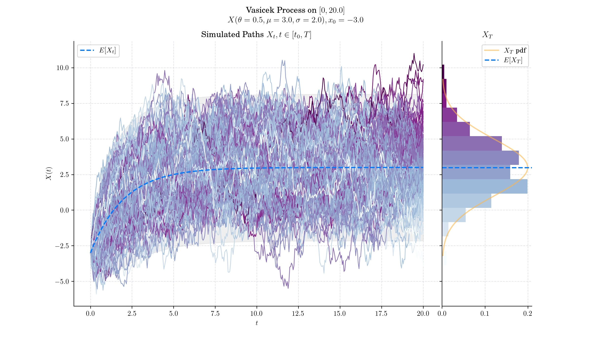

### Day 13 : Vasicek Model (Ornstein-Uhlenbeck continuation)

The Vasicek Model is one of the earliest and most influential mathematical frameworks for modeling interest rates. Developed by Czech mathematician Oldřich Vašíček in 1977, the model is a cornerstone of financial mathematics, especially in the valuation of bonds and interest rate derivatives.

The Vasicek Model is a one-factor short-rate model as it describes interest rate movements as driven by only one source of [market risk](https://en.wikipedia.org/wiki/Market_risk) whose dynamics follow an Ornstein-Uhlenbeck process, known for its mean-reverting properties, which ensure that interest rates do not drift infinitely upward or downward.

#### Definition

Under the Vasicek model, the dynamics of the [instantaneous interest rate](https://en.wikipedia.org/wiki/Force_of_interest) are defined by the following the stochastic differential equation:

$$dX\_t = \theta(\mu - X\_t) dt + \sigma dW\_t, \qquad \geq 0,$$

with initial condition $X\_0 =x\_0\in\mathbb{R}$, and where $W$ is a standard Brownian motion, and the three parameters are constants:

\- $\theta>0$ : speed or mean reversion coefficient

\- $\mu \in \mathbb{R}$ : long term mean

\- $\sigma>0$ : volatility

In order to find the solution to this SDE, let us set the function $f(t,x) = x e^{\theta t}$. Then, Ito's formula implies

$$X\_te^{\theta t} = x\_0 +\int\_0^t X\_s \theta e^{\theta s}ds + \int\_0^t e^{\theta s}dX\_s$$

$$ = x\_0 + \int\_0^t \left\[ \theta X\_s e^{\theta s} +\theta e^{\theta s}(\mu - X\_s)\right\] ds + \int\_0^t e^{\theta s}\sigma dW\_s$$

$$ = x\_0 + \int\_0^t \left\[ \theta e^{\theta s}\mu\right\] ds + \int\_0^t e^{\theta s}\sigma dW\_s$$

$$ = x\_0 + \mu(e^{\theta t} - 1) + \int\_0^t e^{\theta s}\sigma dW\_s.$$

Thus

$$X\_t = x\_0e^{-\theta t} + \mu(1- e^{-\theta t}) + \sigma \int\_0^t e^{-\theta (t-s)}dW\_s., $$

This expression implies that for each $t>0$, the random variable $X\_t$ follows a normal distribution –since it can be expressed as the sum of a deterministic part and the integral of a deterministic function with respect to the Brownian motion.

#### 🔔 Random Facts 🔔

- Vasicek introduced the model in his 1977 paper _"An Equilibrium Characterization of the Term Structure"_ published in the _Journal of Financial Economics_. His work was motivated by the need for a rigorous framework to explain the dynamics of interest rates and the term structure of bond yields.

- Interest rates in the Vasicek Model naturally drift back to the long-term mean $\mu$ over time, at a speed governed by the parameter $\theta$. This aligns with economic observations where extreme interest rate levels are unsustainable and mean reversion is observed.

- The Vasicek Model is an affine model, meaning bond prices and yields can be expressed as exponential-affine functions of time and the short rate. This property facilitates analytical pricing of zero-coupon bonds.

- The model has closed-form solutions for bond prices, making it computationally efficient and widely adopted in practice.

### More to Read 📚

- Vasicek OA. Abstract: An Equilibrium Characterization of the Term Structure. _Journal of Financial and Quantitative Analysis_. 1977;12(4):627-627. doi:10.2307/2330340

- Orlando, Giuseppe; Mininni, Rosa Maria; Bufalo, Michele (July 2020). ["Forecasting interest rates through Vasicek and CIR models: A partitioning approach"](https://onlinelibrary.wiley.com/doi/10.1002/for.2642). _Journal of Forecasting_. **39** (4): 569–579. [arXiv](https://en.wikipedia.org/wiki/ArXiv_\(identifier\)):[1901.02246](https://arxiv.org/abs/1901.02246)

P.s. If you are curious about probability distributions visit the [Advent Calendar 2023](https://quantgirl.blog/advent-calendar-2023/) ✨
