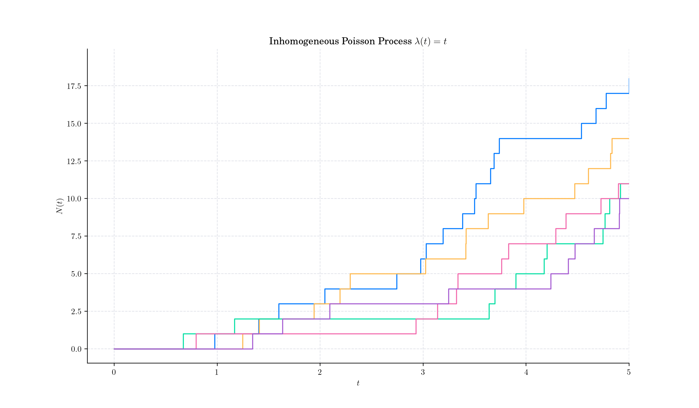
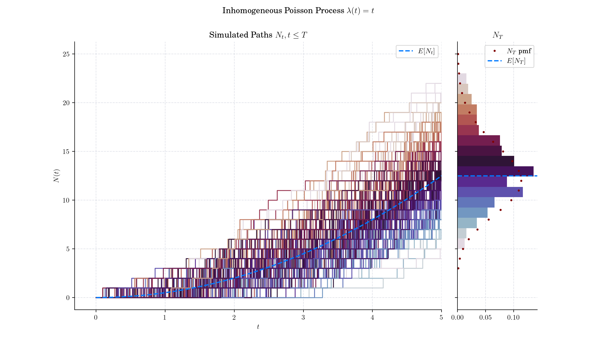
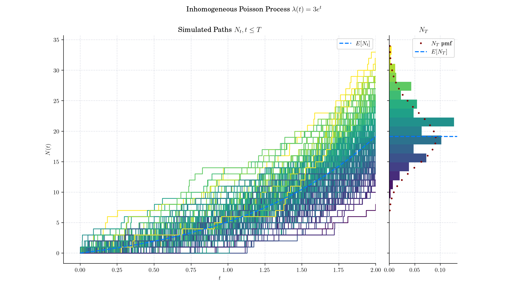
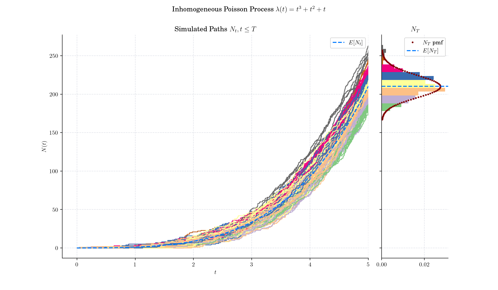
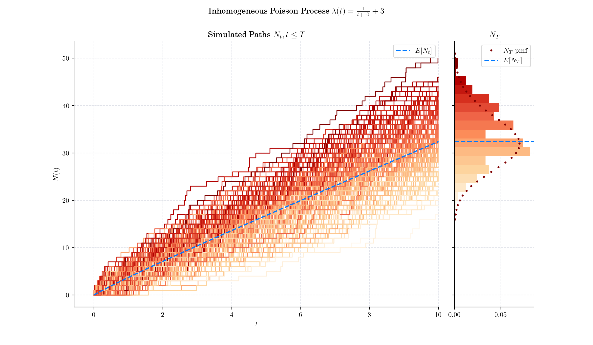

## Day 14: Non-homogeneous Poisson Process

The Inhomogeneous or non-homogeneous Poisson point process is a Poisson point process with a Poisson parameter set as some location-dependent function in the underlying space on which the Poisson process is defined.

### Definition (on the real-line)

On the real line, the inhomogeneous or non-homogeneous Poisson point process has mean measure given by a one-dimensional integral. For two real numbers $a$ and $b$, where $a\leq b$, denote by $N(a,b\]$ the number points of an inhomogeneous Poisson process with intensity function $\lambda(t)$ occurring in the interval $(a,b\]$. The probability of $n$ points existing in the interval $(a, b\]$ is given by:

$$\mathbb{P} ( N(a,b\] = n ) = \frac{\[\Lambda(a,b)\]^n}{n!} e^{-\Lambda(a,b)}$$

where the mean or intensity measure is:

$$\Lambda(a,b) = \int\_a^b\lambda(t)dt,$$

which means that the random variable $N(a,b\]$ follows a Poisson distribution with mean $E\[N(a,b\]\] = \Lambda(a, b)$.

- 

### 🔔 Random Facts 🔔

- A feature of the one-dimension setting, is that an inhomogeneous Poisson process can be transformed into a homogeneous by a [monotone transformation](https://en.wikipedia.org/wiki/Monotonic_function) or mapping, which is achieved with the inverse of $\Lambda$

- The rate at which events occur at time tt is determined by the intensity function $\lambda(t)$, which can be any non-negative function of time. When $\lambda(t) = \lambda$ is constant, it reduces to a homogeneous Poisson process.

- In finance, the Poisson process is widely used to model the occurrence of "rare" events, such as defaults, claims, or jumps in asset prices. For instance, in credit risk modelling, it is employed to describe the likelihood of a borrower defaulting within a certain time frame, where the default is treated as a random, independent event.

- If $T\_i$ are the event times of an non-homogeneous Poisson process with intensity $\lambda(t)$, and $$s\_i=\Lambda(t\_i)$, then $s\_i$​ follow a homogeneous Poisson process with rate 1. This is called a time change property.

- The non-homogeneous Poisson process is widely used in areas such as:
    - **Telecommunications:** Modeling call arrivals where traffic volume varies throughout the day.

    - **Insurance and Finance:** Modeling claim arrivals or market activity with time-varying rates.

    - **Seismology:** Modeling earthquake occurrences with varying risk over time.

    - **Astronomy:** Modeling arrival times of gamma-ray bursts or star formations.

P.s. If you are curious about probability distributions visit the [Advent Calendar 2023](https://quantgirl.blog/advent-calendar-2023/) ✨

