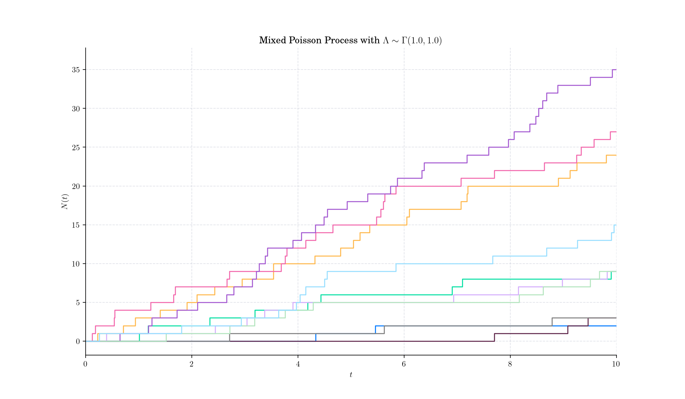
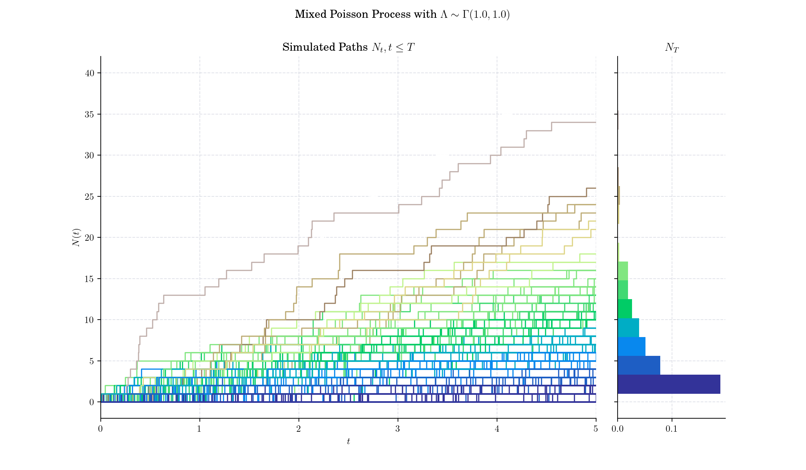
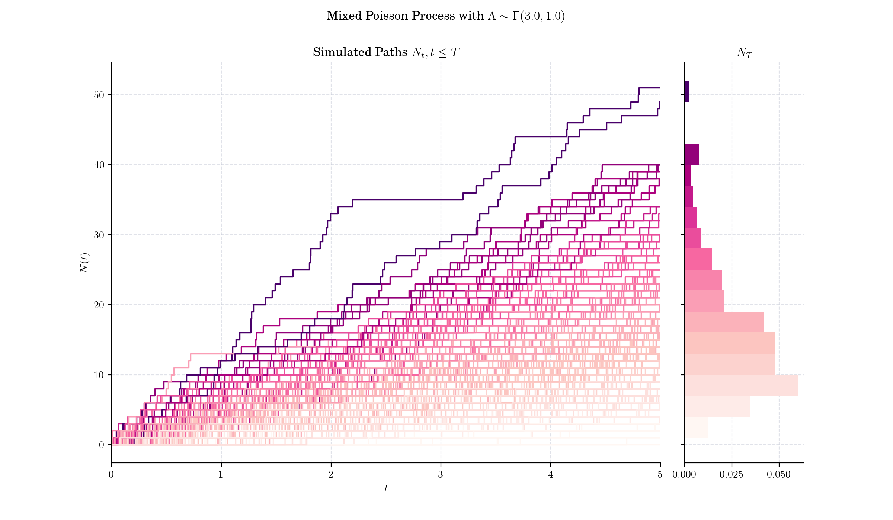
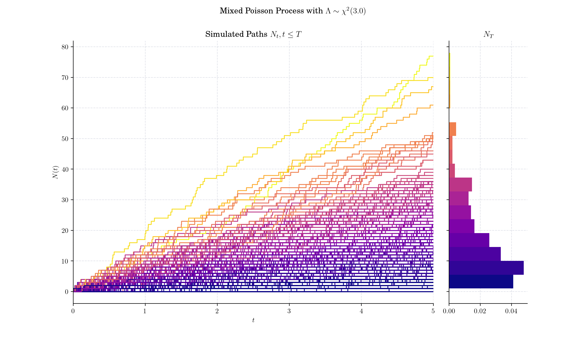
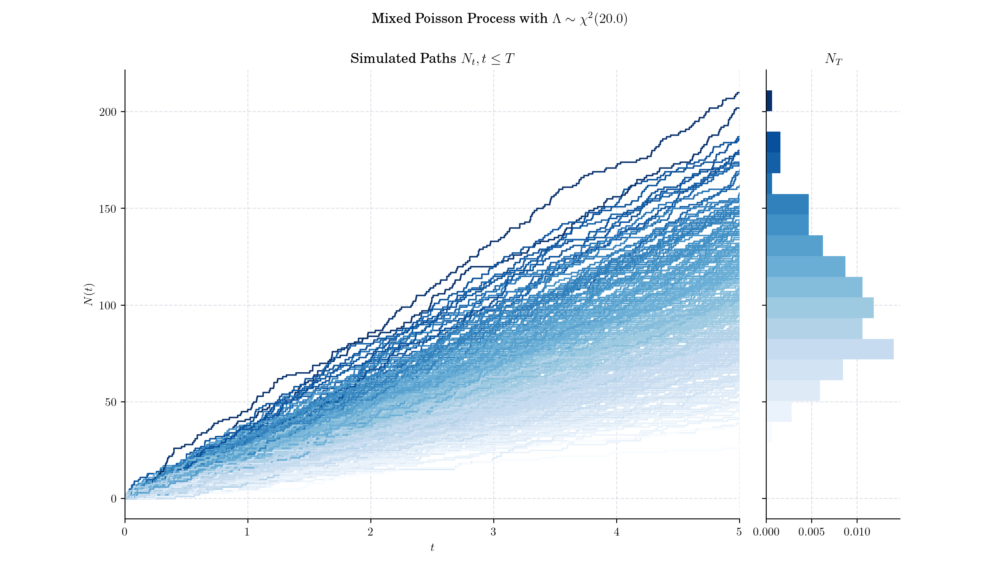

## Day 15: Mixed Poisson Process

The Mixed Poisson Process (MPP) is an extension of the classical Homogeneous Poisson process that incorporates randomness into the rate parameter $\lambda$. In a standard homogeneous Poisson process, the rate parameter $\lambda$ is constant, and events occur independently over time or space. In contrast, a Mixed Poisson Process assumes $\lambda$ is itself a random variable governed by a specified distribution.

### Definition (on the real-line)

A Mixed Poisson process (MPP) $\{N(t), t\in \[0, \infty)\}$ is a counting process with counting distribution of the form:

$$P(N(t)= n) = \int\_0^{\infty} \frac{1}{n!} e^{-\lambda t} (\lambda t)^n d \Lambda(\lambda), \qquad n\in \mathbb{N},$$

where $\Lambda$ is the structure distribution given by $\Lambda(\lambda) = P(\Lambda \leq \lambda)$ with $\Lambda(0)=0$. This type of distribution is known as mixed Poisson distribution which gives the name to the processes.

Note that if $\Lambda$ has density function $g$, we have

$$P(N(t)= n) = \int\_0^{\infty} \frac{1}{n!} e^{-\lambda t} (\lambda t)^n g(\lambda) d\lambda, \qquad n\in \mathbb{N}.$$

Thus, given $\Lambda = \lambda$, $N(t)$ follows a Poisson distribution with parameter $\lambda t$, i.e.:

$$P\left(N(t)= n| \Lambda=\lambda\right) = \frac{1}{n!} e^{-\lambda t} (\lambda t)^n, \qquad n\in\mathbb{N}.$$

- 

### 🔔 Random Facts 🔔

- Mixed Poisson processes were first introduced in 1938 by French mathematician J. Dubourdieu, who wanted to describe the number of claims, in fixed periods, occurring in sickness and accident insurance

- If the intensity random variable $\Lambda$ is degenerate at a constant $\lambda$ ($\lambda > 0$), then we have the Homogeneous Poisson process. This is the only MPP that is simultaneously a renewal process.

- If the intensity random variable $\Lambda$ follows a Gamma distribution, then the resulting counting process $N(t)$ follows a Pascal or negative Binomial distribution. This case is known as the Pascal or Polya process.

- The Mixed Poisson Process is a specific case of a Cox Process, also known as a _doubly stochastic Poisson process_. The Cox process generalises the Poisson process even further by allowing the intensity/rate to vary over time according to an underlying stochastic process

### More to Read 📚

- Teugels, Jozef & Petra, Vynckier. (1996). [The structure distribution in a mixed Poisson process.](https://www.researchgate.net/publication/41448542_The_structure_distribution_in_a_mixed_Poisson_process) Journal of Applied Mathematics and Stochastic Analysis. 9. 10.1155/S1048953396000421.

- Grandell, J. (1997). [Mixed Poisson Processes (1st ed.)](https://www.taylorfrancis.com/books/mono/10.1201/9781003059950/mixed-poisson-processes-grandell). Chapman and Hall/CRC. https://doi.org/10.1201/9781003059950

- D. R. Cox, Some Statistical Methods Connected with Series of Events, _Journal of the Royal Statistical Society: Series B (Methodological)_, Volume 17, Issue 2, July 1955, Pages 129–157, [https://doi.org/10.1111/j.2517-6161.1955.tb00188.x](https://doi.org/10.1111/j.2517-6161.1955.tb00188.x)

P.s. If you are curious about probability distributions visit the [Advent Calendar 2023](https://quantgirl.blog/advent-calendar-2023/) ✨
