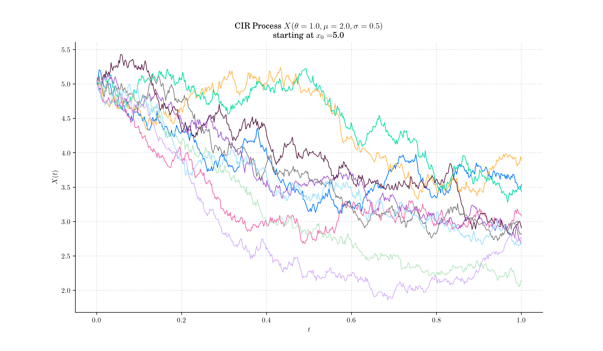
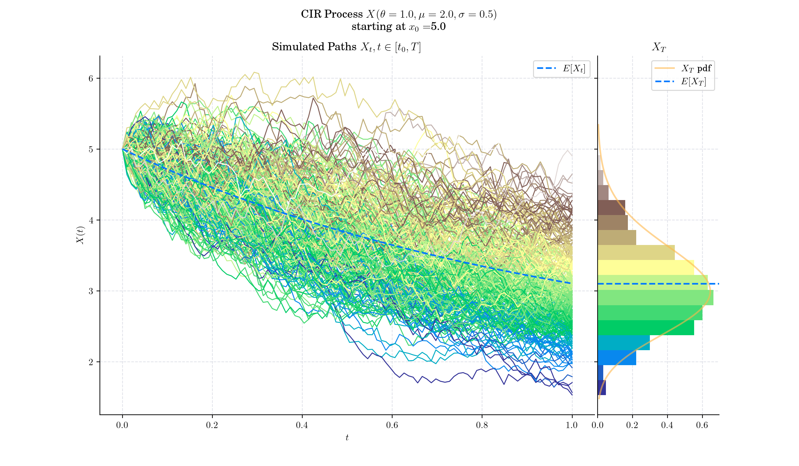
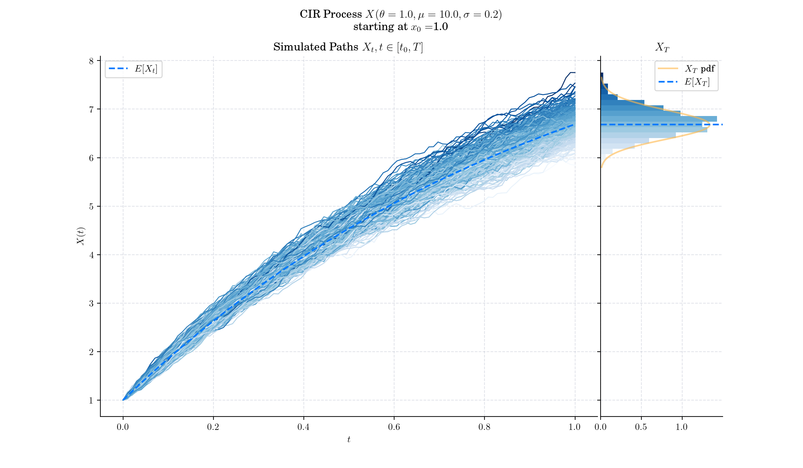
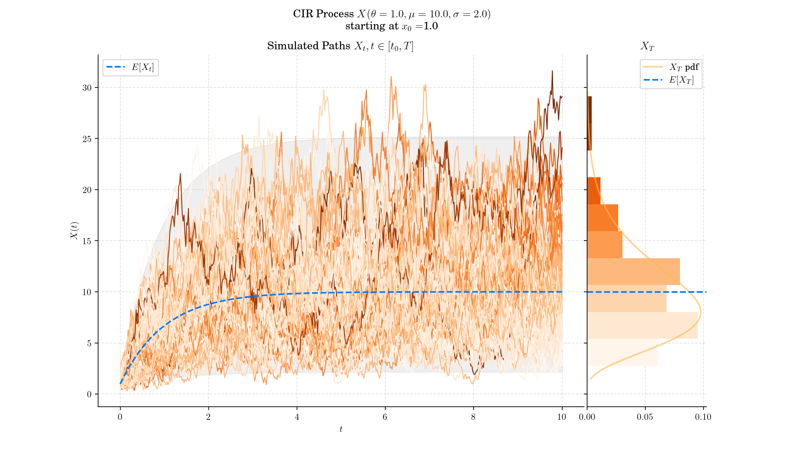
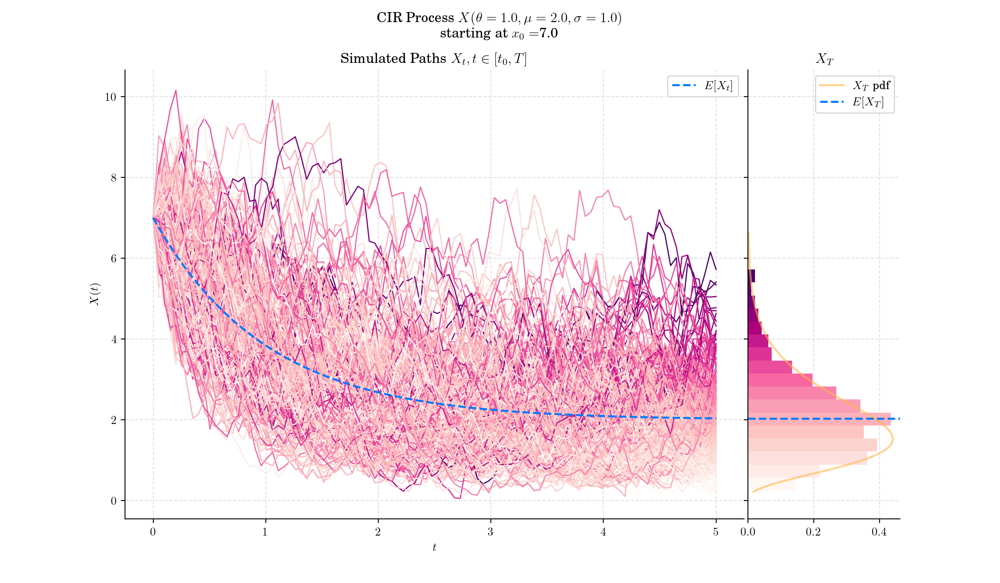

## Day 16: CIR Process

The Cox-Ingersoll-Ross (CIR) model is a widely-used mathematical framework for modelling the evolution of interest rates over time. It is a type of "one factor model" ([short-rate model](https://en.wikipedia.org/wiki/Short-rate_model)) as it describes interest rate movements as driven by only one source of [market risk](https://en.wikipedia.org/wiki/Market_risk). The model can be used in the valuation of [interest rate derivatives](https://en.wikipedia.org/wiki/Interest_rate_derivative).

### Definition

The Cox-Ingersoll-Ross (CIR) model describes the dynamics of interest rates via a stochastic process which can be defined by the following Stochastic Differential Equation (SDE)

$$dX\_t = \theta (\mu - X\_t) dt + \sigma \sqrt{X\_t} dW\_t, \quad t >0,$$

with initial condition $X\_0 =x\_0\in\mathbb{R}$, and where $W\_t$ is a standard Brownian motion, and the three parameters are constants:

- $\theta>0$ : speed or mean reversion coefficient

- $\mu >0$ : long term mean

- $\sigma>0$ : volatility.

- 

### 🔔 Random Facts 🔔

- The CIR model was introduced in 1985, by economists [John C. Cox](https://en.wikipedia.org/wiki/John_C._Cox), [Jonathan E. Ingersoll](https://en.wikipedia.org/wiki/Jonathan_E._Ingersoll) and [Stephen A. Ross](https://en.wikipedia.org/wiki/Stephen_Ross_\(economist\)) as an extension of the [Vasicek model](https://en.wikipedia.org/wiki/Vasicek_model), in their seminal paper _"A Theory of the Term Structure of Interest Rates"_

- The standard deviation factor in the SDE avoids the possibility of negative interest rates for all positive values of $\theta$ and $\mu$. An interest rate of zero is also precluded if the so-called Feller condition $2\theta\mu \geq \sigma^2$, is met.

- The drift factor $\theta(\mu-X\_t)$, is exactly the same as in the Vasicek model. It ensures [mean reversion](https://en.wikipedia.org/wiki/Mean_reversion_\(finance\)) of the interest rate towards the long run value $\mu$, with speed of adjustment governed by the strictly positive parameter $\theta$.

- The CIR model allows for closed-form solutions for certain financial instruments, such as zero-coupon bond prices and some interest rate derivatives, making it practical for use in finance.

- The CIR process is a Bessel Squared process transformed by a space-time change

### More to Read 📚

- [Python Notebok Cox-Ingersoll-Ross Model](https://quantgirluk.github.io/Understanding-Quantitative-Finance/cir_process.html)

- Grandell, J. (1997). [Mixed Poisson Processes (1st ed.)](https://www.taylorfrancis.com/books/mono/10.1201/9781003059950/mixed-poisson-processes-grandell). Chapman and Hall/CRC. https://doi.org/10.1201/9781003059950

- Cox, John C., et al. “[A Theory of the Term Structure of Interest Rates.](https://www.jstor.org/stable/1911242)” _Econometrica_, vol. 53, no. 2, 1985, pp. 385–407. _JSTOR_, https://doi.org/10.2307/1911242. Accessed 16 Dec. 2024.

- Anja Göing-Jaeschke, Marc Yor "[A survey and some generalizations of Bessel processes](https://projecteuclid.org/journals/bernoulli/volume-9/issue-2/A-survey-and-some-generalizations-of-Bessel-processes/10.3150/bj/1068128980.full)," Bernoulli, Bernoulli 9(2), 313-349, (April 2003)

P.s. If you are curious about probability distributions visit the [Advent Calendar 2023](https://quantgirl.blog/advent-calendar-2023/) ✨
