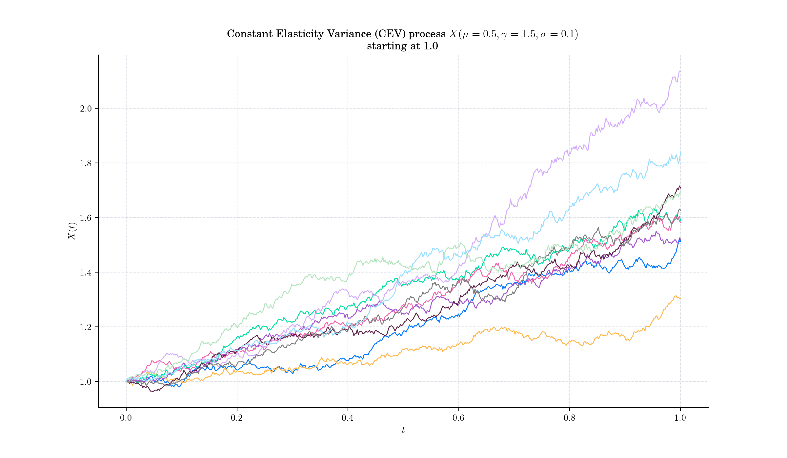
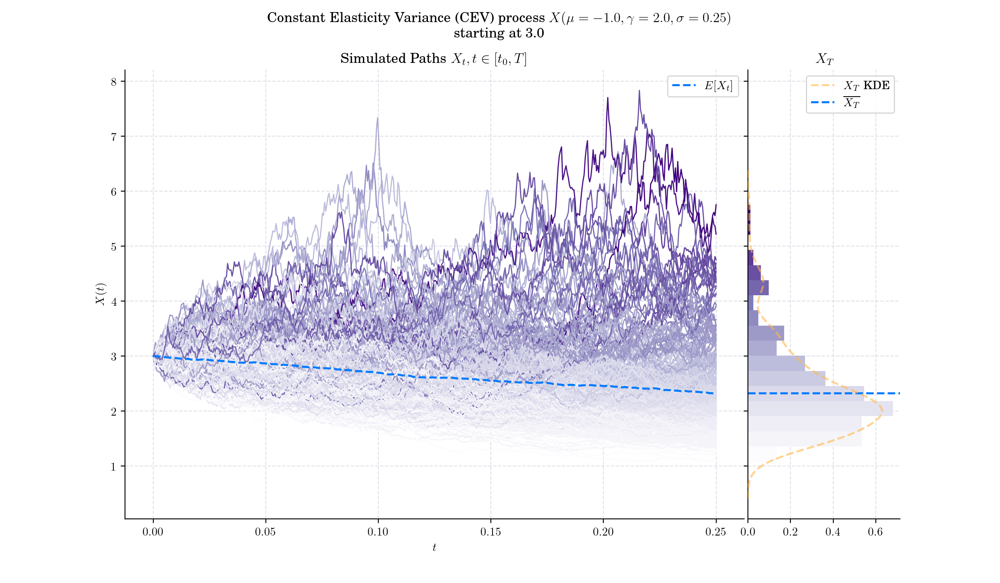
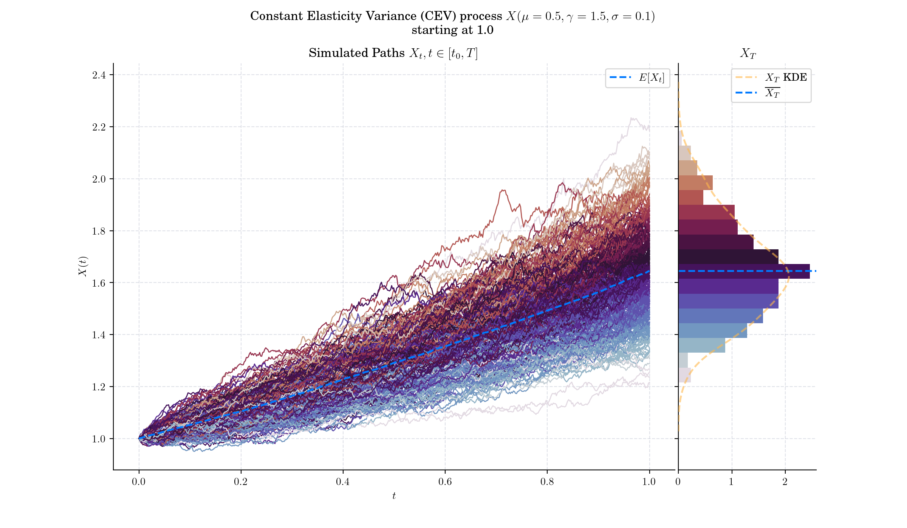
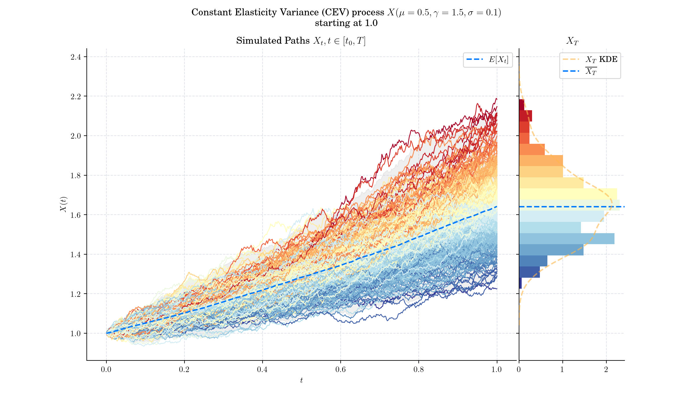
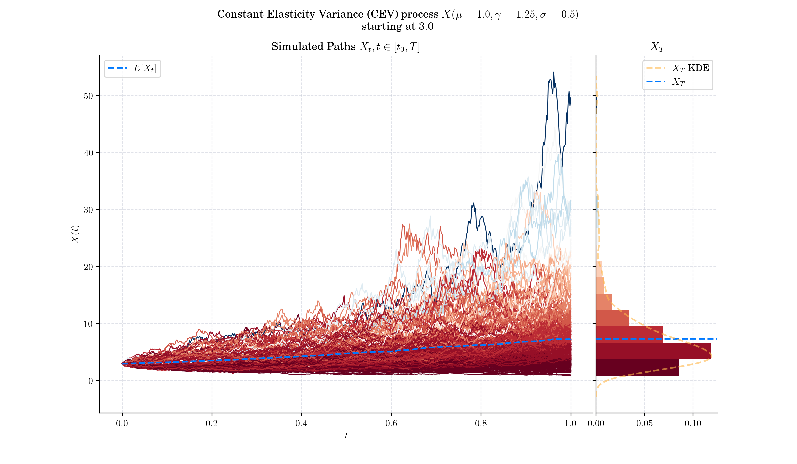
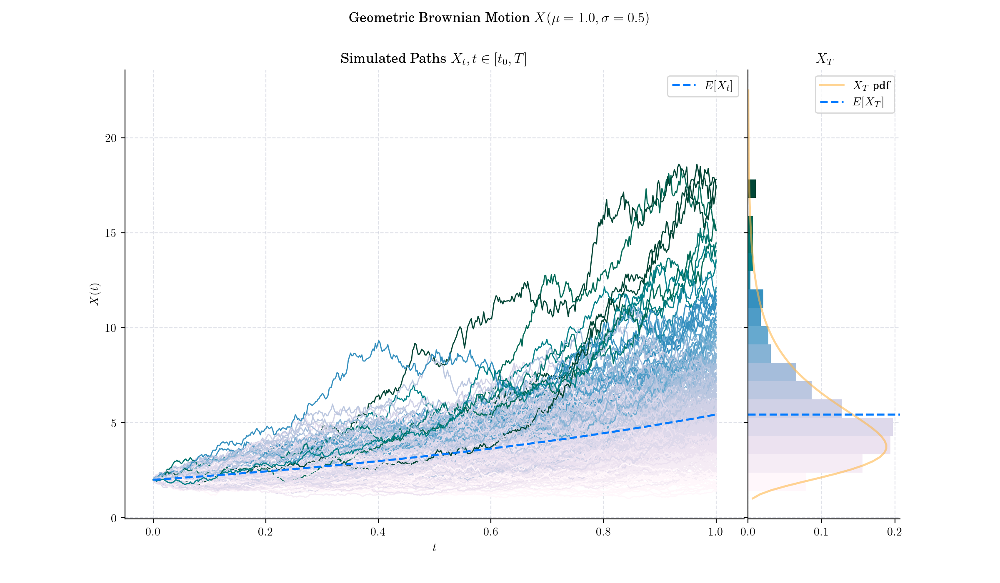
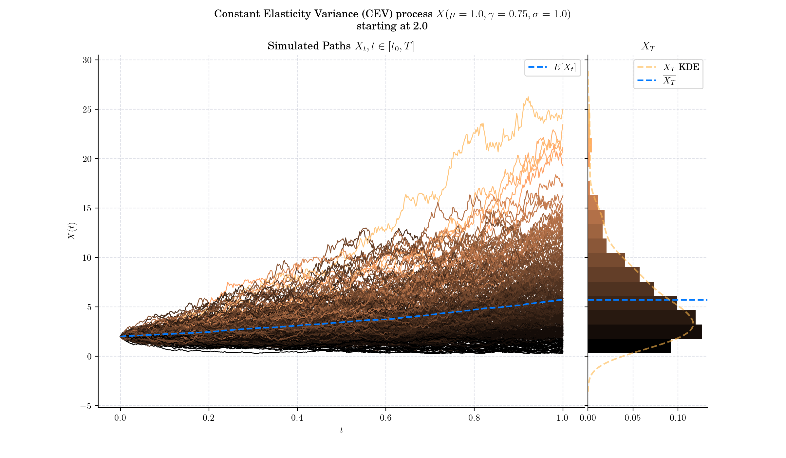

## Day 17: CEV Process

In mathematical finance, the Constant Elasticity of [Variance](https://en.wikipedia.org/wiki/Variance) (CEV) model is a [local volatility](https://en.wikipedia.org/wiki/Local_volatility) model, that attempts to capture stochastic volatility and the [leverage effect](https://en.wikipedia.org/wiki/Leverage_effect). The model is widely used by practitioners in the financial industry, especially for modelling [equities](https://en.wikipedia.org/wiki/Equities) and [commodities](https://en.wikipedia.org/wiki/Commodities).

### Definition

The Constant Elasticity of Variance (CEV) model describes a process following Stochastic Differential Equation (SDE)

$$dX\_t = \mu X\_t dt + \sigma X\_t^{\gamma} dW\_t, \quad t >0,$$

with initial condition $X\_0 =x\_0\in\mathbb{R}$; where $W\_t$ is a standard Brownian motion, and the three parameters are constants.

- $\mu$ is the drift parameter

- $\sigma$ is the constant volatility coefficient

- $\gamma$ is the elasticity parameter

- 

### 🔔 Random Facts 🔔

- The CEV model was first introduced by economist John Cox in 1975 in his seminal paper "Notes on Option Pricing I: Constant Elasticity of Variance Diffusions." Cox proposed the model as a more realistic alternative to the Black-Scholes framework to better capture the behaviour of financial markets, especially the relationship between volatility and asset price levels.

- The key feature of the CEV model lies in the difussion coefficient $\sigma X\_t^{\gamma}$, which scales the volatility of the asset.
    - When $\gamma=1,$ the process in the CEV model corresponds to a Geometric Brownian motion, which means that the model reduces to the the Black-Scholes model

    - For $\gamma<1,$ the volatility decreases as the asset price increases --this is commonly observed in the Equities markets

    - For $\gamma>1,$ the volatility increases with the asset price --observed in the Commodity markets

- Since its introduction, the CEV model has been widely studied and extended. It remains a cornerstone in the field of stochastic processes and financial modeling, particularly for its ability to explain phenomena observed in real-world markets.

### More to Read 📚

- Cox, J. "Notes on Option Pricing I: Constant Elasticity of Diffusions." Unpublished draft, Stanford University, 1975.

- Yuen, K. C., et al. [“ESTIMATION IN THE CONSTANT ELASTICITY OF VARIANCE MODEL.”](https://www.jstor.org/stable/41141790) _British Actuarial Journal_, vol. 7, no. 2, 2001, pp. 275–92. _JSTOR_, http://www.jstor.org/stable/41141790. Accessed 17 Dec. 2024.

- Lindsay, Alan and Brecher, Dominic, Results on the CEV Process, Past and Present (March 9, 2010). Available at SSRN: [https://ssrn.com/abstract=1567864](https://ssrn.com/abstract=1567864) or [http://dx.doi.org/10.2139/ssrn.1567864](https://dx.doi.org/10.2139/ssrn.1567864)

- Y.L. Hsu, T.I. Lin, C.F. Lee, [Constant elasticity of variance (CEV) option pricing model: Integration and detailed derivation, Mathematics and Computers in Simulation](https://www.sciencedirect.com/science/article/pii/S0378475407002601), Volume 79, Issue 1, 2008, Pages 60-71, ISSN 0378-4754, https://doi.org/10.1016/j.matcom.2007.09.012.

P.s. If you are curious about probability distributions visit the [Advent Calendar 2023](https://quantgirl.blog/advent-calendar-2023/) ✨
