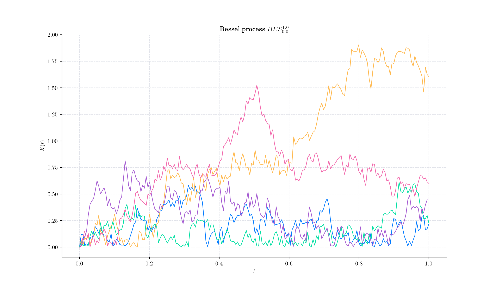
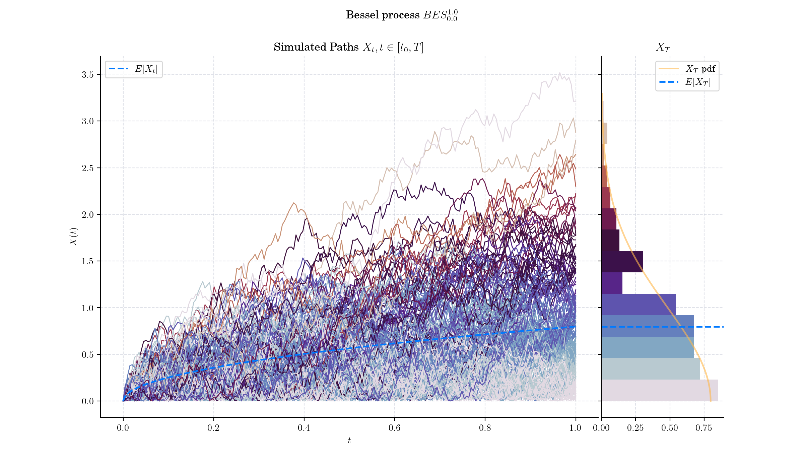
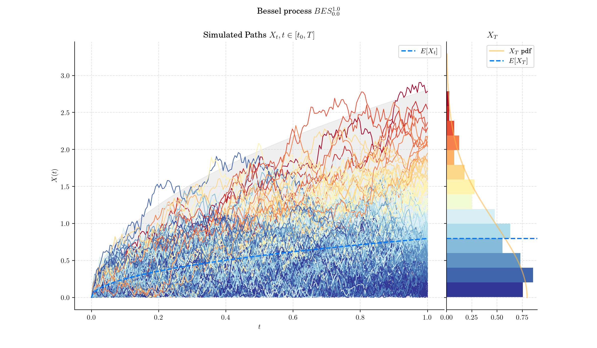
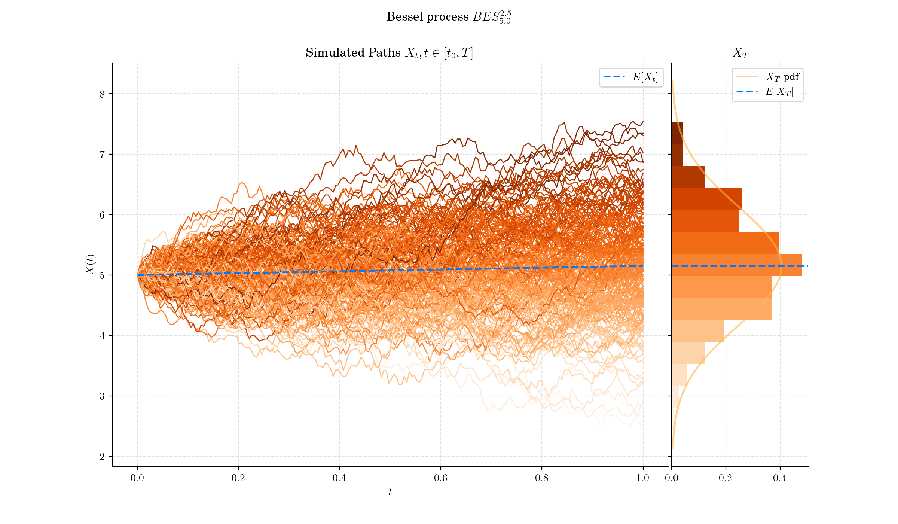
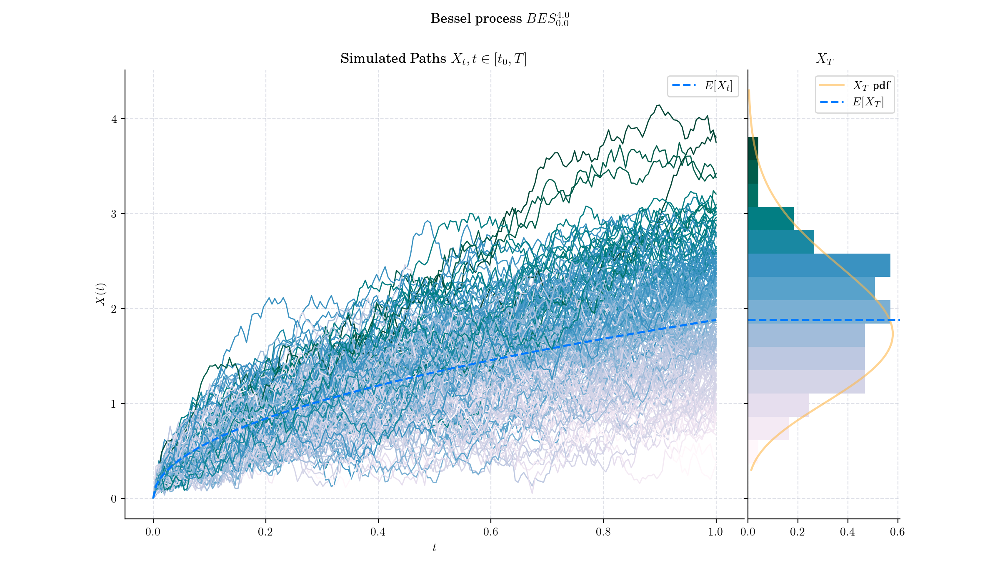

## Day 19: Bessel Process

Bessel processes are a class of stochastic processes that arise naturally in many contexts, including mathematics, physics, finance, and statistical theory. They are closely tied to the concept of Bessel functions, which are solutions to Bessel's differential equation, first studied in the 18th century.

### Definition

For every $\delta\geq 0$ and $x\geq 0$, a **Bessel process** with dimension $\delta$ started at $x$ is defined as the unique strong solution of the SDE

$$X\_t = x + \int\_0^t\frac{\delta - 1}{2X\_s} ds + B\_t, \qquad t\geq 0,$$

and is denoted by $BES^{\delta}\_{x}$.

Bessel processes are frequently parameterised in terms of the quantity

$$\nu = \frac{\delta}{2} -1,$$

which is called **index** of the process.

Given a **Bessel process** $X \sim BES\_x^{(\nu)}$ the marginal distribution $X\_t|X\_0$ (denoted as $X\_t$ for simplicity) has density function

$$f^{(\nu)}\_{X\_t}(u) = \dfrac{u}{t}\left(\dfrac{u}{x}\right)^{\nu}\exp\left(-\dfrac{x^2+u^2}{2t}\right)I\_{\nu}\left(\dfrac{xu}{t} \right), \qquad t\geq 0.$$

where $I\_{\nu}$ is the usual [modified Bessel function](https://en.wikipedia.org/wiki/Bessel_function#Modified_Bessel_functions) with index $\nu$.

### 🔔 Random Facts 🔔

- For $\delta \geq 2,$ the Bessel process is the radial part of a Brownian motion in $\delta$-dimensional space. For $\delta <2,$ it represents a radial-like process with "dimension-like" behaviour but without a direct spatial analogy.

- The Bessel process exhibits a scaling invariance property, meaning $X\_{ct}/c$ has the same distribution as​ $X\_t$ for any $c>0$.

- 0- and 2-dimensional Bessel processes are related to local times of Brownian motion via the [Ray–Knight theorems](https://en.wikipedia.org/wiki/Local_time_\(mathematics\)#Ray%E2%80%93Knight_theorems)

### More to Read 📚

- Jupyter Notebooks on Bessel Processes:
    - Part I: [https://quantgirluk.github.io/Understanding-Quantitative-Finance/bessel\_processes\_part1.html](https://quantgirluk.github.io/Understanding-Quantitative-Finance/bessel_processes_part1.html)

    - Part II: [https://quantgirluk.github.io/Understanding-Quantitative-Finance/bessel\_processes\_part2.html](https://quantgirluk.github.io/Understanding-Quantitative-Finance/bessel_processes_part2.html)

    - Part III: [https://quantgirluk.github.io/Understanding-Quantitative-Finance/bessel\_processes\_part3.html](https://quantgirluk.github.io/Understanding-Quantitative-Finance/bessel_processes_part3.html)

- Anja Göing-Jaeschke. Marc Yor. "A survey and some generalizations of Bessel processes." Bernoulli 9 (2)313 - 349, April 2003. https://doi.org/10.3150/bj/1068128980

P.s. If you are curious about probability distributions visit the [Advent Calendar 2023](https://quantgirl.blog/advent-calendar-2023/) ✨
