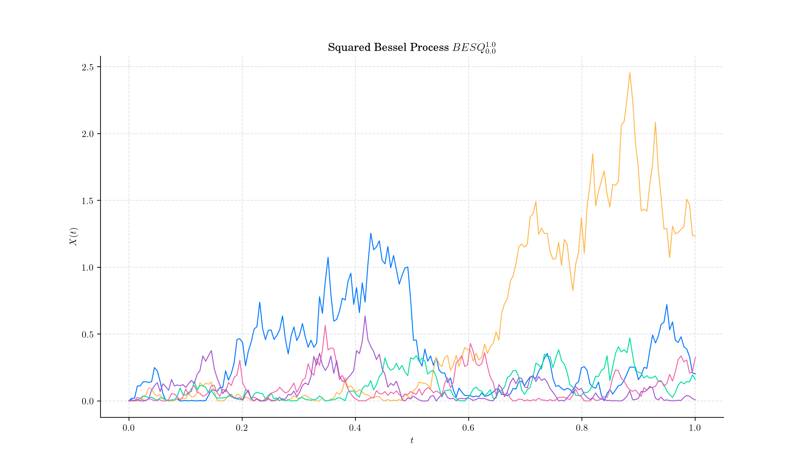
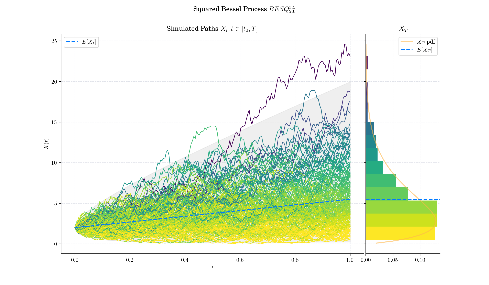
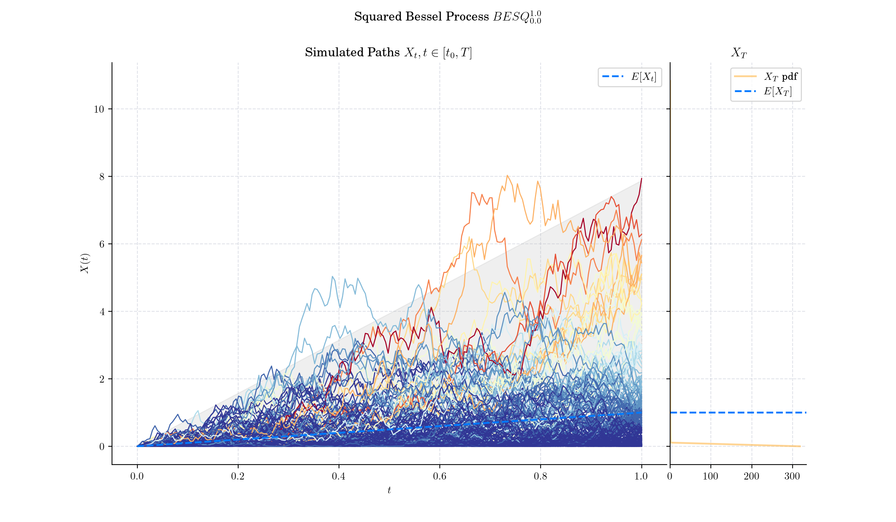
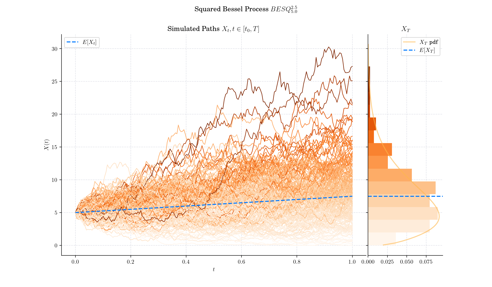
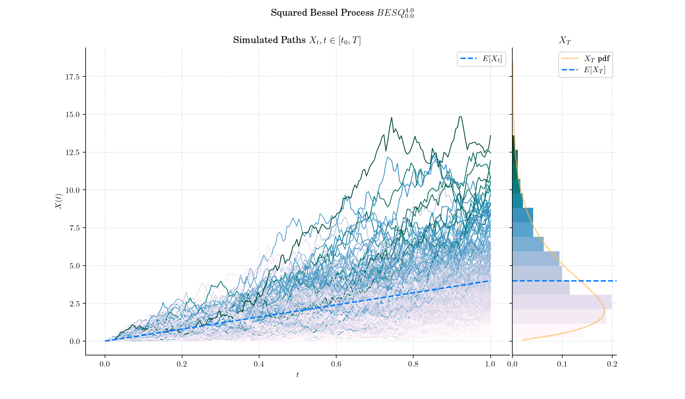

# Day 20: Squared Bessel Process

Bessel processes are a class of stochastic processes that arise naturally in many contexts, including mathematics, physics, finance, and statistical theory. They are closely tied to the concept of Bessel functions, which are solutions to Bessel's differential equation, first studied in the 18th century.

## Definition

For every $\delta\geq 0$ and $x\geq 0$, a **Squared** **Bessel process** with dimension $\delta$ started at $x$ is defined as the unique strong solution of the SDE

$$X\_t = x + \delta t + 2 \int\_0^t \sqrt{ X\_t } dB\_s, \qquad t\geq 0$$

and is denoted by $BESQ^{\delta}\_{x}$.

Bessel processes are frequently parameterised in terms of the quantity

$$\nu = \frac{\delta}{2} -1,$$

which is called **index** of the process.

Given a **Squared Bessel process** $X sim BES\_x^{(\nu)}$ the marginal distribution $X\_t|X\_0$ (denoted as $X\_t$ for simplicity) has density function

$$f\_{X\_t}^{(\nu)}(u) = \dfrac{1}{2t}\left(\dfrac{u}{x}\right)^{\frac{\nu}{2}}\exp\left(-\dfrac{x+u}{2t}\right)I\_{\nu}\left(\dfrac{\sqrt{x u }}{t} \right), \qquad t\geq 0.$$

where $I\_{nu}$ is the usual [modified Bessel function](https://en.wikipedia.org/wiki/Bessel_function#Modified_Bessel_functions) with index $nu$.

## 🔔 Random Facts 🔔

- The CIR process is a Squared Bessel process transformed by the following deterministic space-time change:

$$X\_t = e^{-\theta t} Y\left( \dfrac{\sigma^2}{4\theta} (e^{\theta t} - 1) \right),$$

where $Y =\{Y\_s, s\geq 0\}$ is a Squared Bessel process $BESQ^{\alpha}$, with dimension

$$\alpha = \dfrac{4\theta \mu}{\sigma^2}.$$

- Squared Bessel processes exhibit a scaling invariance property, meaning $X\_{ct}/c$ has the same distribution as​ $X\_t$ for any $c>0$.

- Squared Bessel process find applications in various fields, thanks to its rich mathematical structure and practical implications, including Mathematical Finance, Population Genetics, Physics, and Queueing Theory

- As its name indicates, Squared Bessel process can be represented as the square of the Bessel process

## More to Read 📚

- Jupyter Notebooks on Bessel Processes:
    - Part I: [https://quantgirluk.github.io/Understanding-Quantitative-Finance/bessel\_processes\_part1.html](https://quantgirluk.github.io/Understanding-Quantitative-Finance/bessel_processes_part1.html)
    
    - Part II: [https://quantgirluk.github.io/Understanding-Quantitative-Finance/bessel\_processes\_part2.html](https://quantgirluk.github.io/Understanding-Quantitative-Finance/bessel_processes_part2.html)
    
    - Part III: [https://quantgirluk.github.io/Understanding-Quantitative-Finance/bessel\_processes\_part3.html](https://quantgirluk.github.io/Understanding-Quantitative-Finance/bessel_processes_part3.html)

- Anja Göing-Jaeschke. Marc Yor. "A survey and some generalizations of Bessel processes." Bernoulli 9 (2)313 - 349, April 2003. https://doi.org/10.3150/bj/1068128980

P.s. If you are curious about probability distributions visit the [Advent Calendar 2023](https://quantgirl.blog/advent-calendar-2023/) ✨
