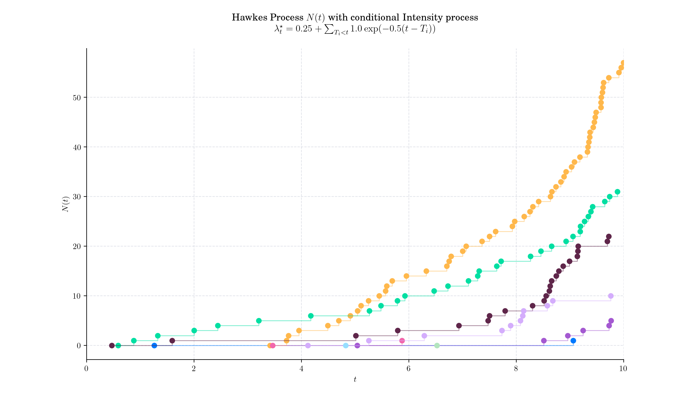
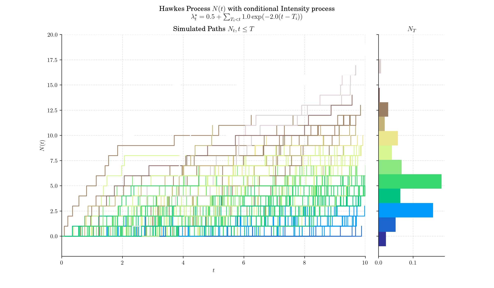
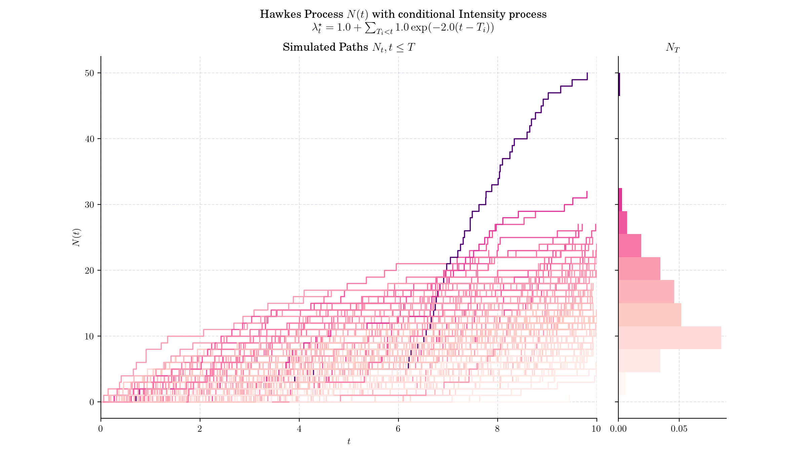
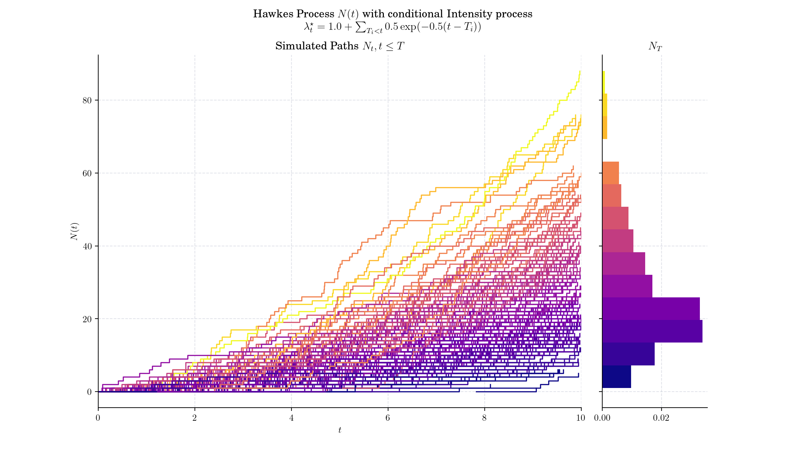
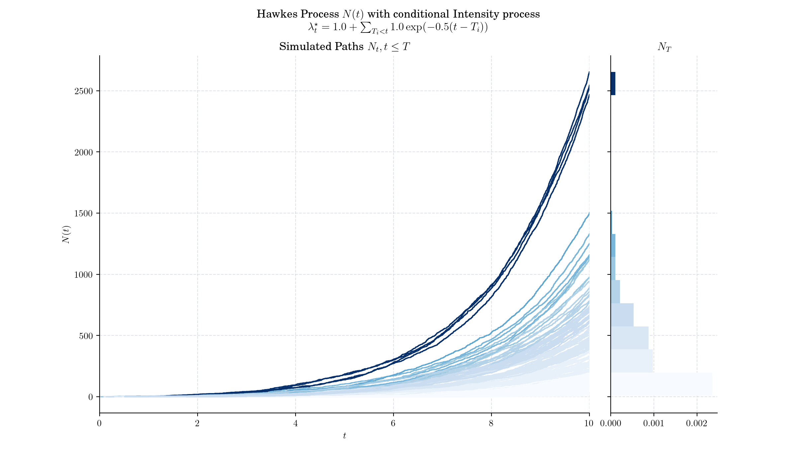

## Day 22: Hawkes Process

The Hawkes process is a type of self-exciting point process, where the occurrence of an event increases the likelihood of subsequent events in the near future. This behaviour is captured in its intensity function, which evolves dynamically with each new event.

## Definition

A Hawkes process is a counting process $N(t)$ whose conditional intensity process is given by

$$\lambda^{\ast}(t) = \mu + \sum\_{T\_i <t} \phi(t-T\_i), \qquad t\geq 0,$$

- $\mu>0,$ is the baseline intensity (rate of events in the absence of previous events) or background arrival rate

- $\phi: \mathbb{R}^{+}\rightarrow \mathbb{R},$ is the excitation function or triggering kernel, a non-negative function representing the influence of past events, and​

- $T\_i,$ are the times of prior events

One simple and quite popular excitation function is  $\phi(t) = \alpha \exp(-\beta t)$, i.e. exponentially decaying intensity. Note that this factorised form, with $\int \beta \exp(-\beta x) = 1,$ leads to a convenient interpretation. $\alpha>0$ is known as the _infectivity factor_, and defines the _average_ number of new occurrences excited by any given occurrence.

## 🔔 Random Facts 🔔

- The Hawkes process was first introduced by Alan G. Hawkes in his seminal 1971 paper, _"Spectra of Some Self-Exciting and Mutually Exciting Point Processes."_ 

- Over the decades, the Hawkes process has been extended to include multivariate forms, which account for interactions between multiple types of events.

- Originally developed to model earthquake occurrences and their aftershocks, the framework has since found applications in a wide range of domains.

- The Hawkes process has found extensive applications in finance, where the timing and clustering of events are often crucial to understanding market dynamics. For instance, in high-frequency trading, trades and orders are executed within milliseconds, creating a need for models that can capture the fine-grained dynamics of market events. The Hawkes process is used to model the **arrival times of trades and order book events**, such as:
    - **Order Placements**: Modeling the times when new buy or sell orders are introduced.
    
    - **Cancellations and Executions**: Understanding how market participants respond to changes in the order book.
    
    - **Market Impact**: Estimating how large trades influence the probability of subsequent orders.

- Self-excitation in the Hawkes process captures phenomena like **order clustering**, where a trade can trigger subsequent trades in rapid succession.

- Depending on parameters, the Hawkes process can exhibit stationary behavior, where its statistical properties remain constant over time.

## More to Read 📚

- Hawkes, Alan G. “Spectra of Some Self-Exciting and Mutually Exciting Point Processes.” _Biometrika_, vol. 58, no. 1, 1971, pp. 83–90. _JSTOR_, https://doi.org/10.2307/2334319.

- Bacry, E.; Delattre, S.; Hoffmann, M.; and Muzy, J. F. "Scaling Limits for Hawkes Processes and Applications to Financial Statistics." 2012. [http://arxiv.org/abs/1202.0842v1](http://arxiv.org/abs/1202.0842v1).

- Carlsson, J.; Foo, M. C.; Lee, H. H.; and Shek, H. "High Frequency Trade Prediction with Bivariate Hawkes Process." 2007. [http://users.iems.northwestern.edu/~armbruster/2007msande444/report1b.pdf](http://users.iems.northwestern.edu/~armbruster/2007msande444/report1b.pdf).

P.s. If you are curious about probability distributions visit the [Advent Calendar 2023](https://quantgirl.blog/advent-calendar-2023/) ✨
