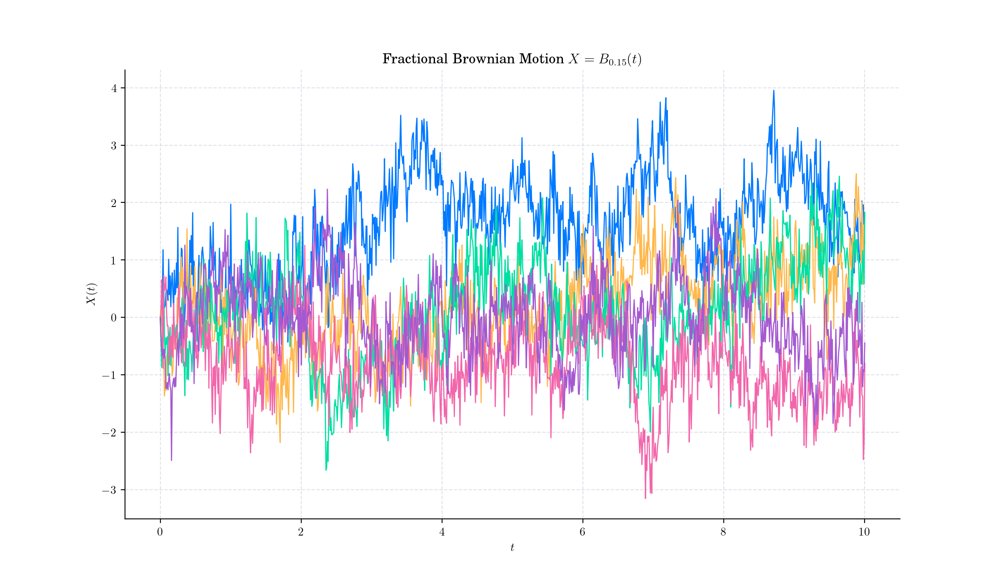
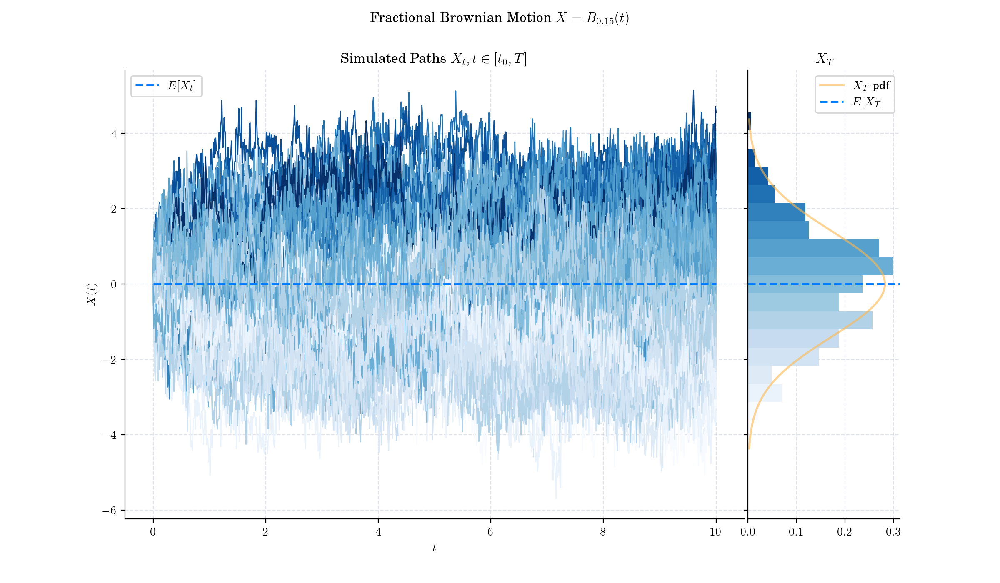
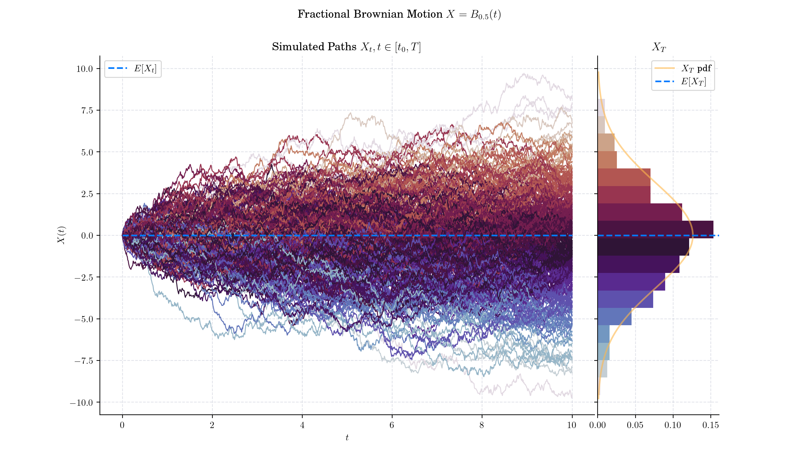
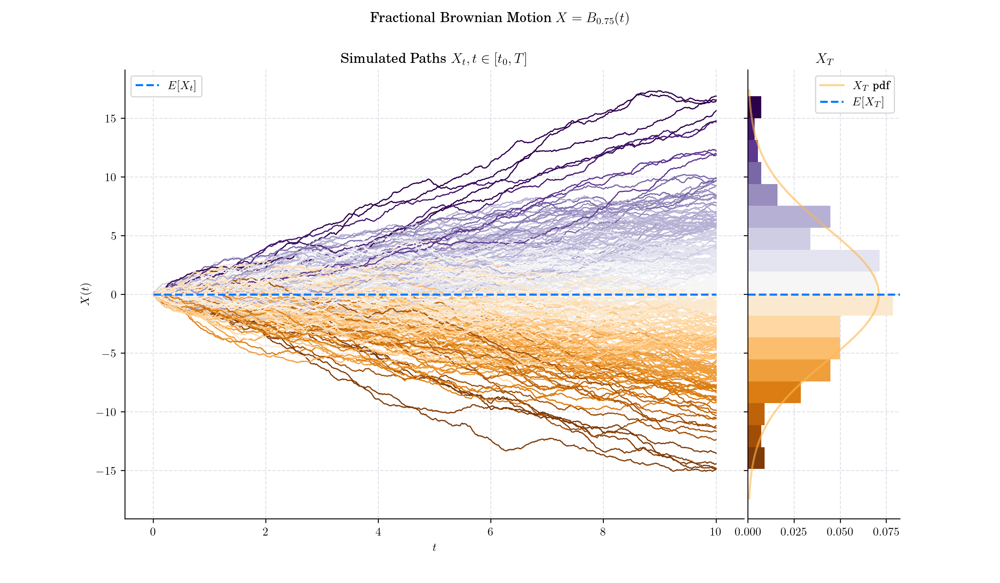
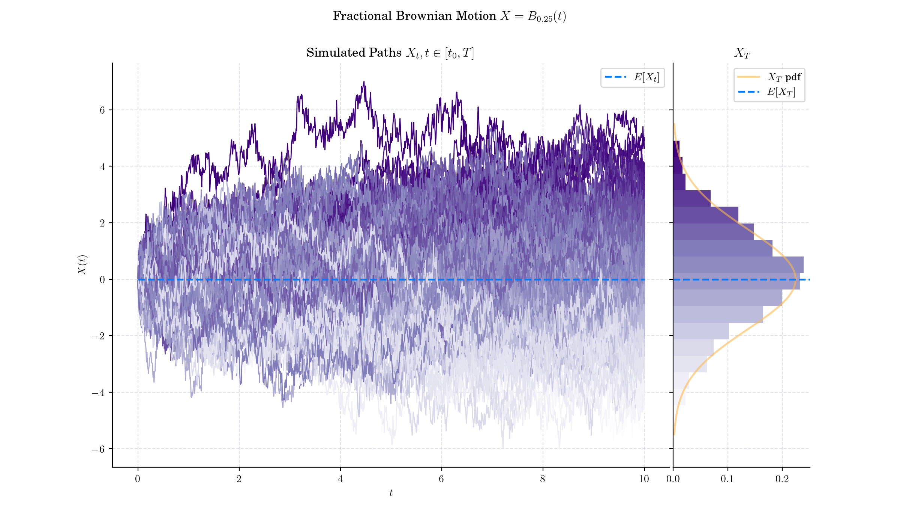

# Day 24: Fractional Brownian motion

Fractional Brownian Motion (fBm) is a generalisation of classical Brownian motion introduced to model complex phenomena exhibiting long-range dependence and self-similarity. Since its inception, fBm has become a cornerstone in fields like finance, physics, and telecommunications. 

## Definition

The fractional Brownian motion (fBM) is a [continuous-time](https://en.wikipedia.org/wiki/Continuous-time_stochastic_process) [Gaussian process](https://en.wikipedia.org/wiki/Gaussian_process) $B\_H(t)$ on $\[0,T\]$ that starts at zero, has expectation zero for all $t$ in $\[0,T\]$, and has the following [covariance function](https://en.wikipedia.org/wiki/Covariance_function):

$$E\left\[B\_H(t) B\_H(s) \right\] = \frac{1}{2}(|t|^{2H}+ |s|^{2H}- |t-s|^{2H}),$$

where _H_ is a real number in (0, 1), called the [Hurst index](https://en.wikipedia.org/wiki/Hurst_exponent) or Hurst parameter associated with the fractional Brownian motion. The value of _H_ determines what kind of process the _fBm_ is:

- if _H_ < 1/2 then the increments of the process are negatively correlated.

- if _H_ = 1/2 then the process is in fact a [Brownian motion](https://en.wikipedia.org/wiki/Brownian_motion) or [Wiener process](https://en.wikipedia.org/wiki/Wiener_process);

- if _H_ > 1/2 then the increments of the process are positively [correlated](https://en.wikipedia.org/wiki/Correlation);

## 🔔 Random Facts 🔔

- Although the main principles of [fBM](https://www.sciencedirect.com/topics/engineering/fractional-brownian-motion) were introduced earlier by Kolmogorov, the name was introduced by Mandelbrot and van Ness (1968) who defined the process as a [stochastic integral](https://www.sciencedirect.com/topics/engineering/stochastic-integral)

- The Hurst exponent describes the raggedness of the resultant motion, with a higher value leading to a smoother motion. It was introduced by [Mandelbrot & van Ness (1968)](https://en.wikipedia.org/wiki/Fractional_Brownian_motion#CITEREFMandelbrotvan_Ness1968).

- There is a generalisation of fractional Brownian motion: **_n_\-th order fractional Brownian motion**, abbreviated as n-fBm.  n-fBm is a [Gaussian](https://en.wikipedia.org/wiki/Gaussian), self-similar, non-stationary process whose increments of order $n$ are stationary.

- The main difference between fractional Brownian motion and regular Brownian motion is that while the increments in Brownian Motion are independent, increments for fractional Brownian motion are not. 

- Various methods have been developed to generate samples of fBm efficiently. To produce our visualisations we use the Davies-Harte method which relies on the Fast Fourier Transform (FFT) and is computationally efficient with complexity $O(n log(n))$.

## More to Read 📚

- Mandelbrot, Benoit B., and John W. Van Ness. “Fractional Brownian Motions, Fractional Noises and Applications.” _SIAM Review_, vol. 10, no. 4, 1968, pp. 422–37. _JSTOR_, http://www.jstor.org/stable/2027184.

- Davies, R. B., and D. S. Harte. “Tests for Hurst Effect.” _Biometrika_, vol. 74, no. 1, 1987, pp. 95–101. _JSTOR_, https://doi.org/10.2307/2336024.

- Sainty, P. (1992), "Construction of a complex-valued fractional Brownian motion of order _N_", _[Journal of Mathematical Physics](https://en.wikipedia.org/wiki/Journal_of_Mathematical_Physics)_, **33** (9): 3128, [Bibcode](https://en.wikipedia.org/wiki/Bibcode_\(identifier\)):[1992JMP....33.3128S](https://ui.adsabs.harvard.edu/abs/1992JMP....33.3128S), [doi](https://en.wikipedia.org/wiki/Doi_\(identifier\)):[10.1063/1.529976](https://doi.org/10.1063%2F1.529976)

P.s. If you are curious about probability distributions visit the [Advent Calendar 2023](https://quantgirl.blog/advent-calendar-2023/) ✨
